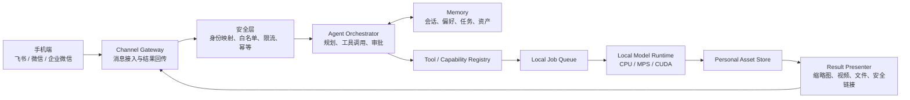

# Personal Digital Assistant — A Web Agent

作者：**Zhuofan Xie**

一个本地优先、可由外部聊天软件远程控制的个人数字助手框架。

项目的最终目标是打通下面这条完整链路：

```text
手机微信 / 飞书发送自然语言指令
                ↓
目标电脑接收并鉴权
                ↓
Agent 理解任务、读取记忆并选择本地功能
                ↓
本地模型或工具生成结果
                ↓
图片 / 视频 / 文件 / 安全预览链接返回聊天窗口
```

当前版本已经完成 Web Agent、模型供应商配置、工具调用、本地异步任务、个人资产库
和空间照片功能。这些模块将作为未来“功能库”的第一批能力，而不是彼此孤立的
Demo。

## 项目状态

| 模块 | 状态 | 说明 |
| --- | --- | --- |
| Web Agent 对话工作台 | MVP | 主页为图文对话和 Root 审批队列；会话、Run 与 LangGraph 轨迹由 SQLite 持久化 |
| LLM 供应商配置 | MVP | 预置 DeepSeek、OpenAI、Qwen、GLM 和自定义兼容接口；可用性待逐项实测 |
| 本地工具注册表 | MVP | 文本、资产、任务、空间照片和图片个性化工具；支持 Schema、Capability Manifest、风险等级、审批与幂等声明 |
| 本地资产与异步任务 | 局部实现 | SQLite 索引、文件资产、任务进度；空间照片和图片风格化已接入，通用恢复/通知仍待抽象 |
| 空间照片 | MVP 已完成 | 单图深度估计、双层 LDI、Three.js 视差 |
| 飞书聊天入口 | 文本已实测、富媒体自动化闭环已完成，待真实租户回归 | 长连接、keepalive/重连、白名单、持久去重、功能卡片、双路径图片下载、owner/chat 隔离多图收集 |
| 身份与工作区绑定 | P0 基础已实现 | 一个飞书 Open ID 一个独立工作区，绑定当前本机节点；Root 可查看和启停，OAuth 用户门户与多电脑路由待实现 |
| 结果回传适配 | 局部实现 | 富文本、状态、2.5D 封面 + Viewer 卡片、风格化预览与下载文件、两类失败重试；Outbox 与固定公网域名待实现 |
| 会话与长期记忆 | 增强 MVP | SQLite 按用户/渠道/会话隔离；Run 与用户事件原子落库，崩溃后按 Run 独立 Checkpoint 对账恢复；上下文使用真实本地 Tokenizer 和强制 Schema 的结构化滚动摘要，正则抽取仅作可观测兜底；长期 claim 与 evidence 分表、时态化、加密并支持审计；已加入敏感召回硬门禁、词法/槽位/语义 RRF+MMR 混合召回、离线评测和效用反馈 |
| 设置与模型安装 | 增强 MVP | 目标机预检、真实能力状态、安装计划、许可确认、白名单执行、SQLite 进度、重启中断恢复和安装后验证已接入；卸载、升级、签名制品与 Spark 实机档位待完成 |
| Flux-GS 多视角 3D | 适配层已合入、真实 GPU 待部署 | 已注册数据集校验、训练创建、状态查询，并接入统一飞书功能菜单；完整迁移时训练 Provider 应作为目标机内的隔离 Linux + NVIDIA 服务，DGX Spark ARM64 尚未通过门禁，单图转 3D 前置链路尚未实现 |
| 微信/企业微信 | 调研阶段 | 优先使用官方开放能力，不接入个人微信非公开协议 |

## 总体架构



完整的模块边界、数据流和安全边界见
[系统架构文档](docs/architecture/system-architecture.md)，上下文记忆链路见
[分层长短期记忆设计](docs/architecture/layered-memory.md)。目标电脑独立承载控制、数据与
模型的部署决策见[单机完整节点架构与迁移方案](docs/guides/full-node-migration.md)。

## 当前可运行能力

### 1. Web Agent

Agent 支持真实 LLM Tool Calling，也支持未配置模型时的规则演示模式。当前使用
LangGraph 和 SQLite Checkpointer 执行受控循环：每次工具调用前进行 Policy 和
Schema 校验，执行后观察结果，模型可以继续规划或完成；代码限制工具步数、重规划、
连续错误、总运行时间和图递归次数。高风险 Tool 可通过 LangGraph Interrupt 暂停，
在 Web Root 控制台或飞书批准/拒绝后从 SQLite Checkpoint 恢复；执行账本避免重放
造成重复副作用。每个 Run 拥有独立 Checkpoint 标识；启动时会把遗留运行分类为可恢复、
待审批、已终态或需人工处置，Root 可继续或明确终止，不会盲目重放。会话历史按渠道、
用户和聊天隔离，显式长期记忆按用户隔离。当前
工具包括：

- 文本统计与关键词提取；
- 当前时间和能力列表；
- 查询本地个人资产；
- 查询异步任务状态；
- 接收本地图片资产 ID，创建空间照片任务。
- 使用内容图与一至三张参考图创建图片个性化任务（默认连接独立 SDXL + IP-Adapter 服务）。
- 使用兼容 Chat Completions `image_url` 的多模态模型进行图片识别、描述、OCR 与连续追问。
- 使用受控 `dataset_id` 校验 COLMAP 数据集、经人工审批提交 Flux-GS GPU 训练，并查询 WebGL 3D 预览链接。

上传图片先在本机校验并转换为受限尺寸的 WebP。仅当用户进行普通看图问答时，图片
才会作为当前请求的多模态输入发送给已配置模型；视觉输入不会写入 LangGraph
Checkpoint 或长期记忆。明确要求空间照片或风格化时，LLM 仍只看到随机资产 ID、
角色和尺寸，由本地工具读取原图。视觉问答附件会短期保留用于对话预览和连续追问，
同一会话后续明确要求空间照片或风格化时也会复用最近一轮仍有效的图片；默认在启动
清理时删除超过 24 小时的暂存文件，其他会话不能引用这些图片。

对于少数把函数调用写成 `<tool_call>{...}` 普通文本的 OpenAI 兼容模型，Planner
只会在调用名属于当前轮已授权工具时将其规范化为真实 Tool Call。空间照片和图片
风格化属于异步任务：创建成功后 Agent 立即把任务移交给 Web/渠道任务监控，不会在
同一工具循环中反复查询状态并耗尽重规划次数。

### 2. 空间照片

当前空间照片链路：

1. 校验 JPG、PNG 或 WebP，移除 EXIF，最长边缩至 1600px；
2. 使用 `Depth Anything V2 Small` 在本机估计相对深度；
3. 使用主体分割保护完整前景：macOS 14+ 默认 Apple Vision，Windows/Linux 可用
   BiRefNet，本地语义分割失败后才降级为深度蒙版；
4. 输出原图、深度图、前景、背景和 `scene.json`；
5. Three.js 使用双层平面与小范围相机移动产生运动视差；
6. 生成结果写入本地资产库，也可以由 Agent 直接调用。

它是低成本的 2.5D MVP，不是完整 3D 重建。实现细节见
[空间照片端侧部署与资产格式](docs/spatial-scene-device-deployment.md)。

## 外部聊天控制

### 第一阶段：飞书文本与媒体闭环

当前已经使用独立的 `lark-channel-sdk` 实现飞书企业自建应用长连接：

- 目标电脑只需主动连接飞书，无需依赖另一台 Mac 中转，也无需暴露公网 IP 或部署公开 Webhook；
- App Secret 与 LLM Key 一样写入系统钥匙串，配置文件不保存明文；
- 使用飞书消息 ID 和本地 SQLite 双层去重；
- 仅允许白名单 Open ID 调用，群聊默认关闭；
- 回调快速转入后台执行，并向原消息回复“已收到”和最终文本；
- 真实飞书应用的长连接和文本消息已经接通；媒体闭环已通过 Fake Channel 自动化测试，
  仍需在已发布权限的真实租户回归。

单张图片消息已接入本地空间照片能力：机器人下载原消息中的图片资源，复用本地图片
安全校验并创建空间照片任务；完成后回复任务状态、封面图和同局域网短时 Viewer
链接。图片风格化也已形成手机闭环：从“菜单”进入后，机器人会持续显示风格化草稿
卡片。可以逐张发送或一次多选两至四张，也可以使用富文本图文，或把 JPG、PNG、
WebP 作为文件发送；直接发送多张图片时也会自动创建风格化草稿，不再落入空间照片
任务。图片随附文字、随后单独发送的文字，以及“开始风格化：……”中的文字都会合并
为模型的补充描述。草稿按飞书会话和用户隔离、保存 30 分钟，可点击“开始生成”或
发送“开始风格化”；完成后机器人同时返回预览图和可下载的 WebP 原始结果文件。
发送“取消风格化”会清理临时图片。空间照片与图片风格化失败时均可复用本机规范化
输入进行幂等重试。Agent 最终回答使用飞书
富文本消息，首次对话或发送“菜单”会返回功能卡片，Web 控制台也会同步最近的渠道
收发记录。手机和电脑处于同一局域网时，可点击签名链接全屏拖动；若飞书内置浏览器
阻止明文局域网 HTTP，可显式启动只暴露签名 Viewer 的临时 HTTPS Tunnel。固定域名、
用户身份认证与链接撤销仍需下一阶段完成。

飞书唯一的统一功能菜单现已加入“3D 场景建模”入口；点击后通过普通消息返回独立 GPU
服务状态、数据集格式和调用方式，不再创建第二张功能卡。Flux-GS 与单图空间照片不同：
上游实现要求预先完成 COLMAP 多视角重建，并会消耗较长 GPU 时间，所以训练创建属于
`external_write`，必须人工审批；飞书只接收受控
`dataset_id`，不会把聊天中的任意路径或命令交给服务器执行。完成后的 `demo_url` 可在
手机浏览器打开 WebGL 预览。当前版本尚未实现飞书直接上传大型 COLMAP 压缩包和训练
完成后的持久化 Outbox 通知，也没有实现“单张图片→合成多视角→估计相机→Flux-GS”
前置流水线，这三项已进入后续计划。

macOS 与 Windows 的一键安装/启动方式见
[本地部署指南](docs/guides/deployment.md)，新能力接入约定见
[Capability 接入指南](docs/guides/capability-integration.md)。
换电脑时，Web、Agent、飞书、数据和模型必须迁移到同一目标节点，详见
[单机完整节点架构与迁移方案](docs/guides/full-node-migration.md)。
Flux-GS 的独立 GPU 服务部署、数据集映射、许可门禁和飞书调用见
[Flux-GS Capability 接入与部署](docs/guides/flux-gs-capability.md)。

### 第二阶段：结果预览

聊天窗口不是完整的 WebGL/3D 运行环境，因此采用分级输出：

| 结果类型 | 聊天窗口内 | 点击后 |
| --- | --- | --- |
| 普通图片 | 直接发送图片 | 查看原图 |
| 空间照片 | 缩略图或视角演示短视频 | 打开带时效签名的 Web Viewer |
| 3DGS / 3D 模型 | 封面图、旋转视频、资产信息 | 打开 WebGL/WebGPU Viewer |
| 大文件 | 文件卡片 | 下载资产包 |
| 长任务 | 可更新的进度卡片 | 查看任务详情 |

### 第三阶段：微信生态

普通个人微信没有面向此类个人 Agent 的稳定公开 Bot 接口，首期不会使用模拟登录或
非公开协议。微信方向优先评估：

1. 企业微信自建应用；
2. 微信公众号；
3. 微信小程序作为 Viewer 或控制面板；
4. 与飞书共用统一 Channel Adapter 接口。

详细调研与接口选择见
[外部聊天控制调研](docs/research/external-chat-control.md)。

## 项目结构

```text
app/
  components/
    AgentConsole.tsx          Web Agent、图片附件、任务进度
    FeishuSettingsDialog.tsx  飞书凭证、白名单与长连接设置
    ModelSettingsDialog.tsx   模型供应商和密钥配置
    SetupCenter.tsx           主机预检、能力安装、进度恢复和整机迁移引导
    SpatialStudio.tsx         空间照片生成与个人资产库
    SpatialViewer.tsx         低功耗 Three.js 视差 Viewer
backend/
  app/
    agent.py                  Agent Runner、执行轨迹、Demo Planner
    llm.py                    OpenAI 兼容 Tool Calling
    capability_setup.py       声明式模型安装、兼容门禁和持久化安装任务
    tools.py                  工具注册表
    assets.py                 深度模型、任务、资产与文件安全
    channel_settings.py       飞书配置与 App Secret 安全存储
    feishu.py                 长连接、鉴权、去重与 Agent 消息闭环
    flux_gs.py                Flux-GS Provider、受控数据集 ID、工具与管理 API
    settings.py               模型配置与密钥安全存储
    main.py                   FastAPI 路由
  tests/                      后端测试
docs/
  architecture/              系统架构、模块边界和路线图
  research/                  平台、模型、协议和产品调研
  learning/                  团队学习笔记与知识索引
tests/                        前端渲染测试
```

文档总入口见 [docs/README.md](docs/README.md)。

## 本地启动

### 环境要求

- Node.js 22+
- pnpm
- Python 3.11 或 3.12
- 推荐至少 8GB 内存
- Apple Silicon 优先使用 MPS，NVIDIA 优先使用 CUDA，否则回退 CPU

### macOS / Linux 一键启动

```bash
chmod +x scripts/setup.sh scripts/start.sh
./scripts/setup.sh --profile core --photo-style skip
./scripts/start.sh
```

打开 `http://localhost:3000/` 后进入“设置”，先查看目标机预检，再逐项安装空间模型、
语义记忆和真实 SDXL + IP-Adapter。安装任务、进度和失败记录保存在本机 SQLite；模型
许可必须由本机所有者明确接受。在已经过验证的 macOS/Windows 档位进行无人值守完整
安装时，仍可使用 `./scripts/setup.sh --accept-model-licenses`；Linux/DGX Spark 先使用 core
档位，由设置中心阻断未经真机验证的模型路径。完整前置条件、Windows Docker GPU Worker、
数据备份/恢复和验收见[完整本地部署与迁移手册](docs/guides/complete-local-deployment.md)。

### Windows 10 / 11 一键启动

前置安装 Python 3.11/3.12、Node.js 22.13+ 与 Git，然后在仓库根目录打开 PowerShell：

```powershell
Set-ExecutionPolicy -Scope Process Bypass
.\scripts\setup.ps1 --profile core --photo-style skip
.\scripts\start.ps1
```

脚本会建立 `.venv`、安装前后端依赖并同时启动 API 与控制台。Windows Defender
Firewall 首次询问时，只允许 Python 访问“专用网络”。NVIDIA GPU 的 SDXL 安装和
故障排查见[跨平台部署指南](docs/guides/deployment.md)。基础服务启动后在 Web“设置”中
逐项安装模型；无人值守环境可改用 `.\scripts\setup.ps1 --accept-model-licenses`。

图片风格化默认依赖独立的
[`frogi-m/pic-style`](https://github.com/frogi-m/pic-style) 服务。推荐在 NVIDIA
Windows 机器上同时运行 Web Agent 与该服务，使主项目通过
`PHOTO_STYLE_SERVICE_URL=http://127.0.0.1:18000` 调用单并发 SDXL + IP-Adapter
Worker。模型许可、约 9.84 GiB 权重准备和 Docker API + Windows Host GPU Worker
步骤以该仓库 README 与 `docs/docker.md` 为准；服务健康检查未通过时，本项目不会
静默降级为 CPU 调色。

统一 `setup` 默认部署真实模型。以下 `deploy-test` 只保留给显式的开发链路测试，不是
默认安装步骤，也不会冒充真实效果：

```bash
./scripts/photo-style.sh doctor
./scripts/photo-style.sh deploy-test
./scripts/photo-style.sh status --json
```

Windows 使用对应的 `.\scripts\photo-style.ps1`。真实模型准备必须先运行 `plan-real`
审阅约 9.84 GiB 固定权重及许可证，再在 Windows NVIDIA 电脑显式执行
`prepare-windows-gpu --accept-model-licenses`，或在 Apple Silicon Mac 执行
`prepare-macos-mps --accept-model-licenses`。MPS 当前属于工程验证路径，必须继续完成固定
样本、稳定性、统一内存、功耗和人工质量门禁，不能继承 Windows CUDA 的验证结论。
`configure-remote` 仅保留给开发期 Provider 联调，不属于目标电脑独立运行的完整迁移。
完整步骤见[图片风格化独立服务部署与迁移](docs/guides/photo-style-deployment.md)。

### 手机临时公网 HTTPS 预览

安装 `cloudflared` 后，确认允许带签名的私人空间照片经 Cloudflare 转发，再另开终端：

```bash
python scripts/start_public_viewer.py --acknowledge-public-media
```

保持该进程运行，新生成的飞书 Viewer 链接会自动改用临时 HTTPS 地址；停止后回退
局域网地址。该模式仅供测试，随机域名不保证稳定，正式上线需使用固定域名与命名
Tunnel。不要把签名链接转发给无关人员。

### 后端

```bash
python3 -m venv .venv
source .venv/bin/activate
python -m pip install --upgrade pip
python -m pip install -r backend/requirements.txt
uvicorn backend.app.main:app --reload --port 8000
```

API 文档：`http://127.0.0.1:8000/docs`

默认完整安装会预下载并哈希锁定 Depth Anything V2 Small 与 BiRefNet，运行时使用本地
只读路径。使用轻量安装并跳过空间模型时，首次生成才会联网下载。

### 跨平台主体分割

如果要在 Windows 或非 macOS 14+ 设备上保持人物、宠物等主体完整，建议额外安装
BiRefNet 分割依赖：

```bash
python -m pip install -r backend/requirements-segmentation.txt
```

默认 `SPATIAL_FOREGROUND_SEGMENTER=auto` 会按 Apple Vision → BiRefNet → 深度蒙版
降级顺序执行。离线部署时先预下载 `ZhengPeng7/BiRefNet` 权重，再设置
`SPATIAL_BIREFNET_LOCAL_FILES_ONLY=true`。

### 本地长期记忆 Embedding

混合召回默认保留零下载 Hash Provider。若要启用真实的本地 Transformer，先显式准备
固定版本的 IBM Granite Embedding 97M Multilingual R2：

```powershell
python backend/scripts/prepare_memory_embedding_model.py --download --smoke-test
```

随后在 `.env` 中设置：

```dotenv
AGENT_MEMORY_SEMANTIC_ENABLED=true
AGENT_MEMORY_EMBEDDING_PROVIDER=transformer
AGENT_MEMORY_EMBEDDING_MODEL_PATH=backend/models/embeddings/granite-embedding-97m-multilingual-r2
```

应用运行时强制 `local_files_only=True`、`trust_remote_code=False`，不会联网下载模型；
向量使用长期记忆密钥加密。历史记忆可在服务停止或低流量时分批回填：

```powershell
python backend/scripts/backfill_memory_embeddings.py `
  --model-path backend/models/embeddings/granite-embedding-97m-multilingual-r2 `
  --all-owners
```

回填只处理允许自动召回的 `always` 记忆，不会为 `never` 记忆生成向量。模型准备需要
联网一次；服务运行、查询和回填均只读取已准备的本地文件。

上下文预算默认复用同一模型目录中的真实 Tokenizer，仅加载 tokenizer 文件：

```dotenv
AGENT_TOKENIZER_BACKEND=auto
AGENT_TOKENIZER_PATH=
```

`AGENT_TOKENIZER_PATH` 留空时复用 `AGENT_MEMORY_EMBEDDING_MODEL_PATH`。`auto` 在本地
Tokenizer 缺失时记录并回退保守估算；生产环境可设为 `transformers`，使配置错误快速失败。

### 前端

另开一个终端：

```bash
pnpm install
pnpm run dev
```

打开 `http://localhost:3000`。

## 模型配置

在页面右上角“模型设置”中选择供应商并填写 API Key。“测试连接”会分别验证普通
问答与 Tool Calling，但不会改变当前运行模型；“保存并启用”会在相同验证通过后
原子切换当前 Planner。配置已保存但尚未启用、问答可用但工具不兼容、配置错误和
Demo 模式会分别显示，不会再静默混用。连接测试目前不验证视觉能力；看图问答需要
模型和 Base URL 额外兼容 Chat Completions 的 `image_url` 内容格式。当前预置：

| 供应商 | 默认 Base URL | 默认模型 |
| --- | --- | --- |
| DeepSeek | `https://api.deepseek.com` | `deepseek-v4-flash` |
| OpenAI | `https://api.openai.com/v1` | `gpt-5.6` |
| Qwen | `https://dashscope.aliyuncs.com/compatible-mode/v1` | `qwen3.7-plus` |
| GLM | `https://open.bigmodel.cn/api/paas/v4` | `glm-5.2` |

这些是代码中的可编辑预置值，不是供应商可用性保证。供应商信息可能变化，应以 UI
连接测试和 `LLM-001` 同日期评测为准。

## 飞书接入配置

完整图文顺序、群聊、图片、`card.action.trigger` 和故障排查请打开
[飞书机器人配置与使用指南](docs/guides/feishu-setup.md)。简要步骤如下：

1. 在[飞书开放平台](https://open.feishu.cn/app)创建企业自建应用，并启用机器人能力；
2. 在事件订阅中选择“使用长连接接收事件”，订阅接收消息事件
   `im.message.receive_v1`；
3. 在“权限管理”搜索中文名“获取单聊、群组消息”和“获取与上传图片或文件资源”；
   如果搜索不到 scope，使用“批量导入/导出权限”导入指南中的 JSON，然后发布新版本；
4. 启动本项目后，点击页面右上角“外部接入”，填写 App ID 与 App Secret；
5. 先点“测试凭证”。测试成功只代表凭证有效，不代表长连接或事件权限已经可用；
6. 第一次可以保持 Open ID 白名单为空并保存启用。私聊机器人后，机器人会回复你的
   Open ID，但不会执行 Agent；
7. 把该 Open ID 加入白名单，再次保存。状态显示“已连接”后即可发送文本指令。

如使用国际版 Lark，在 UI 中把服务区域切换为 Lark。群聊默认不接收；启用后也只有
白名单用户通过 `@机器人` 才能触发。当前 `CHANNEL-002` 支持单图自动生成空间照片，
也支持会话式收集一张内容图和一至三张参考图完成图片风格化，并返回预览与下载文件；
普通文件输入、演示视频、持久化 Outbox 和固定公网 Viewer 尚未实现。

Web 控制台是运行电脑上的 Root 管理员视图，可以查看本机记录的全部 Web 与飞书
会话；普通飞书用户只应使用自己所在的聊天，不应获得 Web 控制台访问权。

参考：[飞书事件订阅概述](https://open.feishu.cn/document/server-docs/event-subscription-guide/overview?from=from_parent_docs)、
[获取消息中的资源文件](https://open.feishu.cn/document/server-docs/im-v1/message/get-2?lang=zh-CN)、
[上传图片](https://open.feishu.cn/document/server-docs/im-v1/image/create?lang=zh-CN)、
[lark-channel-sdk 快速开始](https://github.com/larksuite/channel-sdk-python/blob/main/docs/quickstart.md)。

## 本地数据与隐私

以下内容只保存在本机，不会提交到 GitHub：

- `backend/data/assets/`：图片和生成资产；
- `backend/data/source-images/`：Agent 临时附件；
- `backend/data/assets.sqlite3`：任务和资产索引；
- `backend/data/runs.jsonl`：Agent 执行轨迹；
- `backend/data/settings.json`：本机模型配置；
- `backend/data/feishu_settings.json`：飞书非敏感配置和 Open ID 白名单；
- `backend/data/channel.sqlite3`：飞书事件去重、执行状态和最近 500 条已授权渠道消息镜像；
- `backend/data/*.enc`、`.secret_master_key`：加密密钥材料；
- `backend/data/*.memory-key`：系统钥匙串不可用时的上下文记忆密钥降级文件；
- `.env`、`.venv`、依赖和构建缓存。

API Key 不写入浏览器 `localStorage`、响应体或 Agent 轨迹。后端优先使用系统钥匙串，
不可用时回退到本机加密文件。

## 测试

```bash
source .venv/bin/activate
pytest backend/tests
pnpm run lint
pnpm run test
```

自动测试使用假的深度估计器和假的 LLM 响应，不下载模型、不消耗 Token。

## 协作约定

- `main` 保持可运行；
- 每个功能使用独立分支，例如 `feature/feishu-channel`；
- 通过 Pull Request 合并；
- 不提交 API Key、个人图片、模型权重或本地数据库；
- 新功能必须注册到 Capability Registry，并附带最小测试和文档；
- 调研放在 `docs/research/`，学习笔记放在 `docs/learning/`。

仓库内置项目级 Codex Skill：
[`.codex/skills/team-git-workflow/SKILL.md`](.codex/skills/team-git-workflow/SKILL.md)。
它统一任务领取、分支命名、增量暂存、提交、同步、PR、Review、冲突处理和交接流程，
并保护 API Key、个人媒体、本地数据库与模型权重不被误提交。
说明默认跟随当前会话语言，支持中文和英文两个版本，也可以在指令中明确指定语言。

[中文说明](.codex/skills/team-git-workflow/references/workflow.zh-CN.md) |
[English](.codex/skills/team-git-workflow/references/workflow.en.md)

在 Codex 中可以直接说：

```text
使用 $team-git-workflow 开始飞书接入任务
使用 $team-git-workflow 检查当前改动并创建草稿 PR
使用 $team-git-workflow 处理这个 PR 的冲突并生成交接说明
Use $team-git-workflow in English to prepare this change for review
```

## 近期路线图

1. 使用真实飞书应用验收图片下载、风格化多图收集、结果图片、Viewer 卡片和断线重连；
2. 从当前飞书实现抽象可复用的 `ChannelAdapter` 和统一消息数据模型；
3. 增加审计、速率限制、审批过期和费用预算；
4. 将 Web/飞书消息镜像迁移到统一事件模型，并补充跨渠道身份绑定验收；
5. 增加空间照片 MP4 降级预览、Viewer audience/撤销和固定 HTTPS 域名；
6. 建立 Capability Manifest、安装器和模型依赖隔离；
7. 接入企业微信或微信公众号；
8. 扩展虚拟试衣、虚拟宠物和 3DGS 等本地功能。

## 文档与资料

- [调研与实现中心](docs/project-board.md)
- [文档中心](docs/README.md)
- [完整本地部署与迁移手册](docs/guides/complete-local-deployment.md)
- [从零到可运行个人数字助手](docs/learning/implementation-roadmap.md)
- [调研证据与文档维护方法](docs/learning/research-quality.md)
- [多人 Git 协作 Skill](.codex/skills/team-git-workflow/SKILL.md)
- [系统架构](docs/architecture/system-architecture.md)
- [分层长短期记忆设计](docs/architecture/layered-memory.md)
- [外部聊天控制调研](docs/research/external-chat-control.md)
- [Apple 空间场景技术路线核对](docs/apple-spatial-scene-research.md)
- [空间照片端侧部署与资产格式](docs/spatial-scene-device-deployment.md)

---

Copyright © 2026 Zhuofan Xie. All rights reserved.
