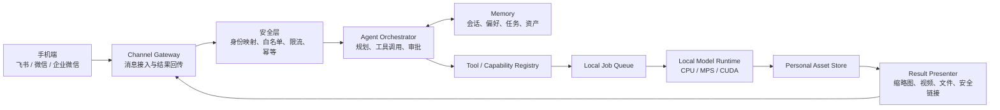

# Personal Digital Assistant — A Web Agent

作者：**Zhuofan Xie**

一个本地优先、可由外部聊天软件远程控制的个人数字助手框架。

项目的最终目标是打通下面这条完整链路：

```text
手机微信 / 飞书发送自然语言指令
                ↓
家中电脑接收并鉴权
                ↓
Agent 理解任务、读取记忆并选择本地功能
                ↓
本地模型或工具生成结果
                ↓
图片 / 视频 / 文件 / 安全预览链接返回聊天窗口
```

当前工作分支已接入 Web Agent、模型供应商配置、工具调用、Capability Registry、
本地异步任务、个人资产库、空间照片和图片风格化功能。这些模块将作为未来
“功能库”的第一批能力，而不是彼此孤立的 Demo。

## 项目状态

| 模块 | 状态 | 说明 |
| --- | --- | --- |
| Web Agent 控制台 | 已完成 | 展示规划、工具调用和最终回答 |
| LLM 供应商配置 | 已完成 | DeepSeek、OpenAI、Qwen、GLM、自定义兼容接口 |
| Capability Registry | 基础完成 | 工具 Schema、运行时 Manifest、作者及运行要求查询 |
| 本地资产与异步任务 | 已完成 | SQLite 索引、文件资产、任务进度 |
| 空间照片 | MVP 已完成 | 单图深度估计、双层 LDI、Three.js 视差 |
| 图片风格化 | MVP 待评审 | 1–3 张参考图、本机 SDXL + IP-Adapter、本地预览与 pic-style HTTP 适配 |
| 外部聊天入口 | 未实现 | 首期计划接入飞书长连接 |
| 结果回传适配 | 未实现 | 图片、短视频、文件、交互预览链接 |
| 长期记忆 | 未实现 | 用户、会话、任务和偏好记忆 |
| 功能/模型库 | 未实现 | 清单、安装、版本、依赖与许可管理 |
| 微信/企业微信 | 调研阶段 | 优先使用官方开放能力，不接入个人微信非公开协议 |

## 总体架构



完整的模块边界、数据流和安全边界见
[系统架构文档](docs/architecture/system-architecture.md)。

## 当前可运行能力

### 1. Web Agent

Agent 支持真实 LLM Tool Calling，也支持未配置模型时的规则演示模式。当前工具包括：

- 文本统计与关键词提取；
- 当前时间和能力列表；
- 查询本地个人资产；
- 查询异步任务状态；
- 接收本地图片资产 ID，创建空间照片任务；
- 接收内容图和一至三张参考图资产 ID，创建图片风格化任务。

图片原始字节不会发给 DeepSeek、Qwen 或 GLM。上传图片先暂存在本机，LLM 只看到
随机资产 ID、文件名和尺寸；任务创建后临时附件会被删除。

### 2. 空间照片

当前空间照片链路：

1. 校验 JPG、PNG 或 WebP，移除 EXIF，最长边缩至 1600px；
2. 使用 `Depth Anything V2 Small` 在本机估计相对深度；
3. 根据深度生成前景 Alpha 和补全后的背景；
4. 输出原图、深度图、前景、背景和 `scene.json`；
5. Three.js 使用双层平面与小范围相机移动产生运动视差；
6. 生成结果写入本地资产库，也可以由 Agent 直接调用。

它是低成本的 2.5D MVP，不是完整 3D 重建。实现细节见
[空间照片端侧部署与资产格式](docs/spatial-scene-device-deployment.md)。

### 3. 图片风格化

图片风格化工作台接收一张内容图和一至三张风格参考图，提供布局模式、质量档位、
风格强度、内容保持与细节保持控制。任务使用与空间照片相同的异步任务和本地个人
资产底座，并在 `GET /api/capabilities` 注册 `photo-style-transfer` Manifest。

默认 `local-preview` Provider 无需下载模型，适合 CPU 开发和回归测试。真实生成既可用
`sdxl-local` 在本机隔离进程运行固定版本的 SDXL + IP-Adapter，也可通过 `pic-style-http`
适配 [`frogi-m/pic-style`](https://github.com/frogi-m/pic-style) 服务。启用本机路径前必须
单独完成约 9.84 GiB 模型下载、许可证确认和 8 GB 显存预检。桌面运行默认使用单次隔离
进程，任务结束后由系统回收约 10 GB 权重；Agent 控制台可一次选择内容图和最多三张参考图。
详见[图片风格化 Skill 集成说明](docs/photo-style-transfer.md)。

## 外部聊天控制的实现路线

### 第一阶段：飞书

优先开发飞书企业自建应用，并使用官方 SDK 的长连接事件订阅：

- 家中电脑只需主动连接飞书，无需暴露公网 IP 或部署公开 Webhook；
- 监听用户发给机器人的消息，转换为统一的 `InboundMessage`；
- 快速返回“已接收”卡片，耗时任务进入本地任务队列；
- 生成完成后更新卡片并发送图片、文件或安全预览链接；
- 使用飞书用户 ID 映射本地用户与记忆空间。

### 第二阶段：结果预览

聊天窗口不是完整的 WebGL/3D 运行环境，因此采用分级输出：

| 结果类型 | 聊天窗口内 | 点击后 |
| --- | --- | --- |
| 普通图片 | 直接发送图片 | 查看原图 |
| 空间照片 | 缩略图或视角演示短视频 | 打开带时效签名的 Web Viewer |
| 3DGS / 3D 模型 | 封面图、旋转视频、资产信息 | 打开 WebGL/WebGPU Viewer |
| 大文件 | 文件卡片 | 下载资产包 |
| 长任务 | 可更新的进度卡片 | 查看任务详情 |

### 第三阶段：微信生态

普通个人微信没有面向此类个人 Agent 的稳定公开 Bot 接口，首期不会使用模拟登录或
非公开协议。微信方向优先评估：

1. 企业微信自建应用；
2. 微信公众号；
3. 微信小程序作为 Viewer 或控制面板；
4. 与飞书共用统一 Channel Adapter 接口。

详细调研与接口选择见
[外部聊天控制调研](docs/research/external-chat-control.md)。

## 项目结构

```text
app/
  components/
    AgentConsole.tsx          Web Agent、图片附件、任务进度
    ModelSettingsDialog.tsx   模型供应商和密钥配置
    PhotoStyleStudio.tsx      图片风格化与结果资产库
    SpatialStudio.tsx         空间照片生成与个人资产库
    SpatialViewer.tsx         低功耗 Three.js 视差 Viewer
backend/
  app/
    agent.py                  Agent Runner、执行轨迹、Demo Planner
    llm.py                    OpenAI 兼容 Tool Calling
    tools.py                  工具注册表
    assets.py                 深度模型、任务、资产与文件安全
    style_transfer.py         图片风格化 Provider、服务与 Capability Manifest
    sdxl_style_provider.py    本机 SDXL + IP-Adapter 推理实现
    sdxl_worker.py            单次隔离模型进程与 UTF-8 进度通道
    style_model_manifest.py   固定模型清单、许可与完整性校验
    settings.py               模型配置与密钥安全存储
    main.py                   FastAPI 路由
  tests/                      后端测试
docs/
  architecture/              系统架构、模块边界和路线图
  research/                  平台、模型、协议和产品调研
  learning/                  团队学习笔记与知识索引
tests/                        前端渲染测试
```

文档总入口见 [docs/README.md](docs/README.md)。

## 本地启动

### 环境要求

- Node.js 22+
- pnpm
- Python 3.9+
- 推荐至少 8GB 内存
- Apple Silicon 优先使用 MPS，NVIDIA 优先使用 CUDA，否则回退 CPU

### 后端

```bash
python3 -m venv .venv
source .venv/bin/activate
python -m pip install --upgrade pip
python -m pip install -r backend/requirements.txt
uvicorn backend.app.main:app --reload --port 8000
```

API 文档：`http://127.0.0.1:8000/docs`

首次生成空间照片会下载约 100MB 的深度模型，之后可以离线推理。

图片风格化默认无需模型下载。若要连接已部署的真实 `pic-style` 服务，请复制
`.env.example` 中的 `PHOTO_STYLE_*` 配置；API Key 只填写在本机 `.env`，不要提交。

本机真实 SDXL 路径必须显式准备：

先安装与当前 NVIDIA 驱动兼容的 CUDA 版 PyTorch，并确认
`torch.cuda.is_available()` 为 `True`，再安装其余可选依赖。RTX 4060 Laptop 的已验证
组合为 PyTorch 2.11.0、Torchvision 0.26.0 与 CUDA 12.8 wheel：

```powershell
python -m pip install torch==2.11.0 torchvision==0.26.0 `
  --index-url https://download.pytorch.org/whl/cu128
python -m pip install -r backend/requirements-gpu.txt
python backend/scripts/prepare_photo_style_models.py --plan
# 审阅命令列出的全部许可证 URL 后，再由操作者明确执行：
python backend/scripts/prepare_photo_style_models.py `
  --download --accept-model-licenses --verify-checksums
```

确认 CUDA 版 PyTorch 可用后，在本机 `.env` 中设置
`PHOTO_STYLE_PROVIDER=sdxl-local`。Web 工作台会通过
`GET /api/photo-style-transfers/provider` 显示模型是否就绪。模型目录、lock、权重、缓存
和生成样本均被排除在 Git 之外；运行时强制离线加载，绝不自动下载。默认的
`PHOTO_STYLE_UNLOAD_AFTER_GENERATION=true` 会在隔离子进程退出时释放模型内存；连续
批处理可显式改为 `false`，以常驻内存换取后续任务更快启动。

### 前端

另开一个终端：

```bash
pnpm install
pnpm run dev
```

打开 `http://localhost:3000`。

## 模型配置

在页面右上角“模型设置”中选择供应商、填写 API Key、测试连接并保存。支持：

| 供应商 | 默认 Base URL | 默认模型 |
| --- | --- | --- |
| DeepSeek | `https://api.deepseek.com` | `deepseek-v4-flash` |
| OpenAI | `https://api.openai.com/v1` | `gpt-5.6` |
| Qwen | `https://dashscope.aliyuncs.com/compatible-mode/v1` | `qwen3.7-plus` |
| GLM | `https://open.bigmodel.cn/api/paas/v4` | `glm-5.2` |

供应商信息可能变化，所有字段均可在 UI 中修改。

## 本地数据与隐私

以下内容只保存在本机，不会提交到 GitHub：

- `backend/data/assets/`：图片和生成资产；
- `backend/data/source-images/`：Agent 临时附件；
- `backend/data/assets.sqlite3`：任务和资产索引；
- `backend/data/runs.jsonl`：Agent 执行轨迹；
- `backend/data/settings.json`：本机模型配置；
- `backend/data/*.enc`、`.secret_master_key`：加密密钥材料；
- `.env`、`.venv`、依赖和构建缓存。

API Key 不写入浏览器 `localStorage`、响应体或 Agent 轨迹。后端优先使用系统钥匙串，
不可用时回退到本机加密文件。

## 测试

```bash
source .venv/bin/activate
pytest backend/tests
pnpm run lint
pnpm run test
```

自动测试使用假的深度估计器、确定性的本地风格预览 Provider 和假的 LLM 响应，
不下载模型、不消耗 Token。

## 协作约定

- `main` 保持可运行；
- 每个功能使用独立分支，例如 `feature/feishu-channel`；
- 通过 Pull Request 合并；
- 不提交 API Key、个人图片、模型权重或本地数据库；
- 新功能必须注册到 Capability Registry，并附带最小测试和文档；
- 调研放在 `docs/research/`，学习笔记放在 `docs/learning/`。

仓库内置项目级 Codex Skill：
[`.codex/skills/team-git-workflow/SKILL.md`](.codex/skills/team-git-workflow/SKILL.md)。
它统一任务领取、分支命名、增量暂存、提交、同步、PR、Review、冲突处理和交接流程，
并保护 API Key、个人媒体、本地数据库与模型权重不被误提交。
说明默认跟随当前会话语言，支持中文和英文两个版本，也可以在指令中明确指定语言。

[中文说明](.codex/skills/team-git-workflow/references/workflow.zh-CN.md) |
[English](.codex/skills/team-git-workflow/references/workflow.en.md)

在 Codex 中可以直接说：

```text
使用 $team-git-workflow 开始飞书接入任务
使用 $team-git-workflow 检查当前改动并创建草稿 PR
使用 $team-git-workflow 处理这个 PR 的冲突并生成交接说明
Use $team-git-workflow in English to prepare this change for review
```

## 近期路线图

1. 抽象 `ChannelAdapter` 和统一消息数据模型；
2. 接入飞书长连接，完成文本指令和文本回复；
3. 增加身份白名单、幂等、审计和高风险操作审批；
4. 增加 SQLite 记忆层和会话摘要；
5. 实现空间照片缩略图、演示视频和签名预览链接；
6. 建立 Capability Manifest、安装器和模型依赖隔离；
7. 接入企业微信或微信公众号；
8. 扩展虚拟试衣、虚拟宠物和 3DGS 等本地功能。

## 文档与资料

- [调研与实现中心](docs/project-board.md)
- [文档中心](docs/README.md)
- [多人 Git 协作 Skill](.codex/skills/team-git-workflow/SKILL.md)
- [系统架构](docs/architecture/system-architecture.md)
- [外部聊天控制调研](docs/research/external-chat-control.md)
- [Apple 空间场景技术路线核对](docs/apple-spatial-scene-research.md)
- [空间照片端侧部署与资产格式](docs/spatial-scene-device-deployment.md)
- [图片风格化 Skill 集成说明](docs/photo-style-transfer.md)

---

Copyright © 2026 Zhuofan Xie. All rights reserved.
