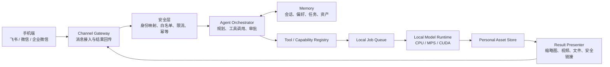

# Personal Digital Assistant — A Web Agent

作者：**Zhuofan Xie**

一个本地优先、可由外部聊天软件远程控制的个人数字助手框架。

项目的最终目标是打通下面这条完整链路：

```text
手机微信 / 飞书发送自然语言指令
                ↓
家中电脑接收并鉴权
                ↓
Agent 理解任务、读取记忆并选择本地功能
                ↓
本地模型或工具生成结果
                ↓
图片 / 视频 / 文件 / 安全预览链接返回聊天窗口
```

当前版本已经完成 Web Agent、模型供应商配置、工具调用、本地异步任务、个人资产库
和空间照片功能。这些模块将作为未来“功能库”的第一批能力，而不是彼此孤立的
Demo。

## 项目状态

| 模块 | 状态 | 说明 |
| --- | --- | --- |
| Web Agent 对话工作台 | MVP | 主页为图文对话和 Root 审批队列；会话、Run 与 LangGraph 轨迹由 SQLite 持久化 |
| LLM 供应商配置 | MVP | 预置 DeepSeek、OpenAI、Qwen、GLM 和自定义兼容接口；可用性待逐项实测 |
| 本地工具注册表 | MVP | 文本、资产、任务和空间照片工具；支持基础 Schema、风险等级、审批与幂等声明，角色权限/超时/版本待补 |
| 本地资产与异步任务 | 局部实现 | SQLite 索引、文件资产、任务进度；目前仅空间照片专用且未验证重启恢复 |
| 空间照片 | MVP 已完成 | 单图深度估计、双层 LDI、Three.js 视差 |
| 飞书聊天入口 | 文本闭环已实测，富媒体开发中 | 长连接、白名单、持久去重、富文本回答、功能卡片、单图空间照片 |
| 结果回传适配 | 局部实现 | 富文本、状态、功能卡片和空间照片封面；短视频、文件、交互预览链接待实现 |
| 会话与长期记忆 | MVP | SQLite 按用户/渠道/会话隔离；Web 会话列表与消息 API 已完成，支持显式记住、查看、忘记与清空当前对话 |
| 工具库 | UI MVP | 已区分已安装、未安装、待上线；通用安装器、版本、依赖与许可管理尚未实现 |
| 微信/企业微信 | 调研阶段 | 优先使用官方开放能力，不接入个人微信非公开协议 |

## 总体架构



完整的模块边界、数据流和安全边界见
[系统架构文档](docs/architecture/system-architecture.md)。

## 当前可运行能力

### 1. Web Agent

Agent 支持真实 LLM Tool Calling，也支持未配置模型时的规则演示模式。当前使用
LangGraph 和 SQLite Checkpointer 执行受控循环：每次工具调用前进行 Policy 和
Schema 校验，执行后观察结果，模型可以继续规划或完成；代码限制工具步数、重规划、
连续错误、总运行时间和图递归次数。高风险 Tool 可通过 LangGraph Interrupt 暂停，
在 Web Root 控制台或飞书批准/拒绝后从 SQLite Checkpoint 恢复；执行账本避免重放
造成重复副作用。会话历史按渠道、用户和聊天隔离，显式长期记忆按用户隔离。当前
工具包括：

- 文本统计与关键词提取；
- 当前时间和能力列表；
- 查询本地个人资产；
- 查询异步任务状态；
- 接收本地图片资产 ID，创建空间照片任务。

图片原始字节不会发给 DeepSeek、Qwen 或 GLM。上传图片先暂存在本机，LLM 只看到
随机资产 ID、文件名和尺寸；任务创建后临时附件会被删除。

### 2. 空间照片

当前空间照片链路：

1. 校验 JPG、PNG 或 WebP，移除 EXIF，最长边缩至 1600px；
2. 使用 `Depth Anything V2 Small` 在本机估计相对深度；
3. 根据深度生成前景 Alpha 和补全后的背景；
4. 输出原图、深度图、前景、背景和 `scene.json`；
5. Three.js 使用双层平面与小范围相机移动产生运动视差；
6. 生成结果写入本地资产库，也可以由 Agent 直接调用。

它是低成本的 2.5D MVP，不是完整 3D 重建。实现细节见
[空间照片端侧部署与资产格式](docs/spatial-scene-device-deployment.md)。

## 外部聊天控制

### 第一阶段：飞书文本闭环

当前已经使用独立的 `lark-channel-sdk` 实现飞书企业自建应用长连接：

- 家中电脑只需主动连接飞书，无需暴露公网 IP 或部署公开 Webhook；
- App Secret 与 LLM Key 一样写入系统钥匙串，配置文件不保存明文；
- 使用飞书消息 ID 和本地 SQLite 双层去重；
- 仅允许白名单 Open ID 调用，群聊默认关闭；
- 回调快速转入后台执行，并向原消息回复“已收到”和最终文本；
- 真实飞书应用的长连接和文本消息已经接通；断线恢复与媒体权限仍在继续实测。

单张图片消息已接入本地空间照片能力：机器人下载原消息中的图片资源，复用本地图片
安全校验并创建空间照片任务；完成后回复任务状态和封面图。Agent 最终回答使用飞书
富文本消息，首次对话或发送“菜单”会返回功能卡片，Web 控制台也会同步最近的渠道
收发记录。飞书聊天窗口不能直接运行当前 Three.js Viewer，因此可动视角仍需在电脑端
打开；手机端需要下一阶段的 HTTPS、短时签名 Viewer URL，聊天内则用 JPG/MP4 降级。

### 第二阶段：结果预览

聊天窗口不是完整的 WebGL/3D 运行环境，因此采用分级输出：

| 结果类型 | 聊天窗口内 | 点击后 |
| --- | --- | --- |
| 普通图片 | 直接发送图片 | 查看原图 |
| 空间照片 | 缩略图或视角演示短视频 | 打开带时效签名的 Web Viewer |
| 3DGS / 3D 模型 | 封面图、旋转视频、资产信息 | 打开 WebGL/WebGPU Viewer |
| 大文件 | 文件卡片 | 下载资产包 |
| 长任务 | 可更新的进度卡片 | 查看任务详情 |

### 第三阶段：微信生态

普通个人微信没有面向此类个人 Agent 的稳定公开 Bot 接口，首期不会使用模拟登录或
非公开协议。微信方向优先评估：

1. 企业微信自建应用；
2. 微信公众号；
3. 微信小程序作为 Viewer 或控制面板；
4. 与飞书共用统一 Channel Adapter 接口。

详细调研与接口选择见
[外部聊天控制调研](docs/research/external-chat-control.md)。

## 项目结构

```text
app/
  components/
    AgentConsole.tsx          Web Agent、图片附件、任务进度
    FeishuSettingsDialog.tsx  飞书凭证、白名单与长连接设置
    ModelSettingsDialog.tsx   模型供应商和密钥配置
    SpatialStudio.tsx         空间照片生成与个人资产库
    SpatialViewer.tsx         低功耗 Three.js 视差 Viewer
backend/
  app/
    agent.py                  Agent Runner、执行轨迹、Demo Planner
    llm.py                    OpenAI 兼容 Tool Calling
    tools.py                  工具注册表
    assets.py                 深度模型、任务、资产与文件安全
    channel_settings.py       飞书配置与 App Secret 安全存储
    feishu.py                 长连接、鉴权、去重与 Agent 消息闭环
    settings.py               模型配置与密钥安全存储
    main.py                   FastAPI 路由
  tests/                      后端测试
docs/
  architecture/              系统架构、模块边界和路线图
  research/                  平台、模型、协议和产品调研
  learning/                  团队学习笔记与知识索引
tests/                        前端渲染测试
```

文档总入口见 [docs/README.md](docs/README.md)。

## 本地启动

### 环境要求

- Node.js 22+
- pnpm
- Python 3.9+
- 推荐至少 8GB 内存
- Apple Silicon 优先使用 MPS，NVIDIA 优先使用 CUDA，否则回退 CPU

### 后端

```bash
python3 -m venv .venv
source .venv/bin/activate
python -m pip install --upgrade pip
python -m pip install -r backend/requirements.txt
uvicorn backend.app.main:app --reload --port 8000
```

API 文档：`http://127.0.0.1:8000/docs`

首次生成空间照片会下载约 100MB 的深度模型，之后可以离线推理。

### 前端

另开一个终端：

```bash
pnpm install
pnpm run dev
```

打开 `http://localhost:3000`。

## 模型配置

在页面右上角“模型设置”中选择供应商、填写 API Key、测试连接并保存。当前预置：

| 供应商 | 默认 Base URL | 默认模型 |
| --- | --- | --- |
| DeepSeek | `https://api.deepseek.com` | `deepseek-v4-flash` |
| OpenAI | `https://api.openai.com/v1` | `gpt-5.6` |
| Qwen | `https://dashscope.aliyuncs.com/compatible-mode/v1` | `qwen3.7-plus` |
| GLM | `https://open.bigmodel.cn/api/paas/v4` | `glm-5.2` |

这些是代码中的可编辑预置值，不是供应商可用性保证。供应商信息可能变化，应以 UI
连接测试和 `LLM-001` 同日期评测为准。

## 飞书接入配置

完整图文顺序、群聊、图片、`card.action.trigger` 和故障排查请打开
[飞书机器人配置与使用指南](docs/guides/feishu-setup.md)。简要步骤如下：

1. 在[飞书开放平台](https://open.feishu.cn/app)创建企业自建应用，并启用机器人能力；
2. 在事件订阅中选择“使用长连接接收事件”，订阅接收消息事件
   `im.message.receive_v1`；
3. 按飞书控制台提示申请接收消息、以机器人身份发送消息和“获取与上传图片或文件
   资源（`im:resource`）”权限，发布一个可用版本，并让测试用户处于应用可用范围；
4. 启动本项目后，点击页面右上角“外部接入”，填写 App ID 与 App Secret；
5. 先点“测试凭证”。测试成功只代表凭证有效，不代表长连接或事件权限已经可用；
6. 第一次可以保持 Open ID 白名单为空并保存启用。私聊机器人后，机器人会回复你的
   Open ID，但不会执行 Agent；
7. 把该 Open ID 加入白名单，再次保存。状态显示“已连接”后即可发送文本指令。

如使用国际版 Lark，在 UI 中把服务区域切换为 Lark。群聊默认不接收；启用后也只有
白名单用户通过 `@机器人` 才能触发。当前 `CHANNEL-002` 支持一次发送一张图片并
自动生成空间照片、返回封面；多图、普通文件、演示视频和交互 Viewer 链接尚未实现。

Web 控制台是运行电脑上的 Root 管理员视图，可以查看本机记录的全部 Web 与飞书
会话；普通飞书用户只应使用自己所在的聊天，不应获得 Web 控制台访问权。

参考：[飞书事件订阅概述](https://open.feishu.cn/document/server-docs/event-subscription-guide/overview?from=from_parent_docs)、
[获取消息中的资源文件](https://open.feishu.cn/document/server-docs/im-v1/message/get-2?lang=zh-CN)、
[上传图片](https://open.feishu.cn/document/server-docs/im-v1/image/create?lang=zh-CN)、
[lark-channel-sdk 快速开始](https://github.com/larksuite/channel-sdk-python/blob/main/docs/quickstart.md)。

## 本地数据与隐私

以下内容只保存在本机，不会提交到 GitHub：

- `backend/data/assets/`：图片和生成资产；
- `backend/data/source-images/`：Agent 临时附件；
- `backend/data/assets.sqlite3`：任务和资产索引；
- `backend/data/runs.jsonl`：Agent 执行轨迹；
- `backend/data/settings.json`：本机模型配置；
- `backend/data/feishu_settings.json`：飞书非敏感配置和 Open ID 白名单；
- `backend/data/channel.sqlite3`：飞书事件去重、执行状态和最近 500 条已授权渠道消息镜像；
- `backend/data/*.enc`、`.secret_master_key`：加密密钥材料；
- `.env`、`.venv`、依赖和构建缓存。

API Key 不写入浏览器 `localStorage`、响应体或 Agent 轨迹。后端优先使用系统钥匙串，
不可用时回退到本机加密文件。

## 测试

```bash
source .venv/bin/activate
pytest backend/tests
pnpm run lint
pnpm run test
```

自动测试使用假的深度估计器和假的 LLM 响应，不下载模型、不消耗 Token。

## 协作约定

- `main` 保持可运行；
- 每个功能使用独立分支，例如 `feature/feishu-channel`；
- 通过 Pull Request 合并；
- 不提交 API Key、个人图片、模型权重或本地数据库；
- 新功能必须注册到 Capability Registry，并附带最小测试和文档；
- 调研放在 `docs/research/`，学习笔记放在 `docs/learning/`。

仓库内置项目级 Codex Skill：
[`.codex/skills/team-git-workflow/SKILL.md`](.codex/skills/team-git-workflow/SKILL.md)。
它统一任务领取、分支命名、增量暂存、提交、同步、PR、Review、冲突处理和交接流程，
并保护 API Key、个人媒体、本地数据库与模型权重不被误提交。
说明默认跟随当前会话语言，支持中文和英文两个版本，也可以在指令中明确指定语言。

[中文说明](.codex/skills/team-git-workflow/references/workflow.zh-CN.md) |
[English](.codex/skills/team-git-workflow/references/workflow.en.md)

在 Codex 中可以直接说：

```text
使用 $team-git-workflow 开始飞书接入任务
使用 $team-git-workflow 检查当前改动并创建草稿 PR
使用 $team-git-workflow 处理这个 PR 的冲突并生成交接说明
Use $team-git-workflow in English to prepare this change for review
```

## 近期路线图

1. 使用真实飞书应用验收长连接、断线重连、权限和文本闭环；
2. 从当前飞书实现抽象可复用的 `ChannelAdapter` 和统一消息数据模型；
3. 增加审计、速率限制、审批过期和费用预算；
4. 将已完成的 Web SQLite 会话模型扩展到统一渠道消息，并增加会话摘要；
5. 实现空间照片缩略图、演示视频和签名预览链接；
6. 建立 Capability Manifest、安装器和模型依赖隔离；
7. 接入企业微信或微信公众号；
8. 扩展虚拟试衣、虚拟宠物和 3DGS 等本地功能。

## 文档与资料

- [调研与实现中心](docs/project-board.md)
- [文档中心](docs/README.md)
- [从零到可运行个人数字助手](docs/learning/implementation-roadmap.md)
- [调研证据与文档维护方法](docs/learning/research-quality.md)
- [多人 Git 协作 Skill](.codex/skills/team-git-workflow/SKILL.md)
- [系统架构](docs/architecture/system-architecture.md)
- [外部聊天控制调研](docs/research/external-chat-control.md)
- [Apple 空间场景技术路线核对](docs/apple-spatial-scene-research.md)
- [空间照片端侧部署与资产格式](docs/spatial-scene-device-deployment.md)

---

Copyright © 2026 Zhuofan Xie. All rights reserved.
