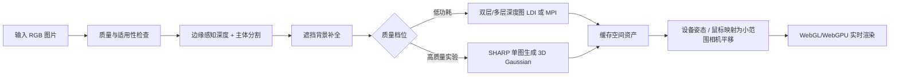

# Apple 锁屏与空间场景技术路线核对

作者：**Zhuofan Xie**  
更新日期：2026-07-23

## 结论

macOS 与单图空间场景是两类不同产品：

- macOS 的 Landscape、Cityscape、Underwater 和 Earth 锁屏/壁纸使用慢动作航拍素材，在锁定和解锁时继续播放或过渡。它不是从用户的一张照片实时推断三维视角。
- iOS 26 的空间场景锁屏会在用户移动 iPhone 时产生三维效果。
- visionOS 26 的 Spatial Scene 是公开资料中最接近本项目目标的能力：Apple 将其描述为由 AI 和计算深度生成多个视角，并以带真实深度的三维图像和运动视差呈现。

因此，本项目应以“iOS/visionOS 空间场景”为技术目标，而不是以“macOS 航拍锁屏”为目标。

## Apple 已公开的信息

Apple 没有公开 iOS 锁屏空间场景的内部实现，也没有说明它是否使用 SHARP。以下流程是由 Apple 的产品文档、RealityKit API 与 Apple SHARP 论文共同支持的工程推导，不应表述为 Apple 系统的完整源代码流程。

1. 判断图片是否适合空间化。Apple 的用户文档指出，合格图片通常具有良好光照、清晰的主体/背景分离，或者是风景图。
2. 从 2D 图像生成三维表示。RealityKit 文档称 Spatial Scene 会利用 AI 和计算深度生成多个视角，并生成带纹理的三维几何，而不是只保存一张灰度深度图。
3. 运行时只允许附近视角。运动视差由设备或观察者的小幅移动驱动，适合自然姿态变化，不用于绕场景大范围行走。
4. 渲染器处理可见性和遮挡。单层网格无法表示被主体遮挡的背景，需要多层深度、补全后的背景或 3D Gaussian 表示。
5. 提供返回 2D 的能力。Apple 也明确提示空间场景可能出现伪影，建议提供 mono/2D 回退。

## 本项目当前流程判断

| 环节 | 当前实现 | 判断 |
| --- | --- | --- |
| 本地深度估计 | Depth Anything V2 Small | 可作为低功耗 MVP，方向正确 |
| 深度后处理 | 单张 8-bit 深度图、全局高斯模糊 | 会损伤毛发等边界，需要减弱模糊并做边缘感知处理 |
| 三维表示 | 单张连续细分平面 | 只能做 2.5D，无法表示遮挡后的区域 |
| 视角运动 | 网格旋转、相机平移、UV 偏移叠加 | 重复计算视差，是拉伸和“橡皮布感”的主要原因 |
| 交互输入 | 鼠标位置、方向键 | 适合桌面 Web；移动端应增加设备姿态输入 |
| 功耗 | 事件触发渲染、低功耗 GPU、DPR 上限 | 方向正确，应继续保留 |

## 推荐流程

### 第一阶段：自然的低功耗 2.5D

- 保留 Depth Anything V2 Small。
- 只通过相机平移产生运动视差，不旋转整张图片，也不同时进行 UV 视差。
- 对深度图进行边缘感知采样，保留人物、宠物和毛发轮廓。
- 限制相机活动范围并使用阻尼回中。
- 下一小步增加主体蒙版、背景补全和至少两层深度表示。

### 第二阶段：高质量空间场景

- 使用 Apple SHARP 作为研究模式，将单图直接转换为 3D Gaussian `.ply`。
- SHARP 使用 Depth Pro 特征、两个深度层和 Gaussian 解码器；论文报告每张图约输出 120 万个 Gaussians。
- 浏览器侧接入 3DGS renderer，只允许附近视角，避免展示模型未覆盖的大范围移动。
- SHARP 模型许可证仅允许研究用途，进入商业产品前必须替换为可商用方案或取得许可。

## 性能与能耗策略

- 空闲时不运行 `requestAnimationFrame`；只在输入、阻尼回中或尺寸变化时渲染。
- 页面不可见时暂停渲染和模型任务。
- 将设备像素比限制在 1.5–1.75，移动端根据温度和帧时动态降到 1.0。
- 2.5D 模式使用低功耗 GPU；3DGS 模式按设备能力限制 Gaussian 数量并提供半分辨率档位。
- 深度/3DGS 生成结果落盘缓存，同一资产不重复推理。
- 移动端设备姿态先低通滤波，再映射到有限 headbox；不直接使用原始陀螺仪数据驱动相机。

## 主要资料

- Apple Support, macOS wallpaper:
  https://support.apple.com/guide/mac-help/choose-your-desktop-picture-mchlp3013/mac
- Apple Support, iOS 26 Lock Screen:
  https://support.apple.com/en-us/102638
- Apple RealityKit, `Spatial3DImage`:
  https://developer.apple.com/documentation/realitykit/imagepresentationcomponent/spatial3dimage
- Apple WWDC25, What’s new in RealityKit:
  https://developer.apple.com/videos/play/wwdc2025/287/
- Apple Machine Learning Research, SHARP:
  https://machinelearning.apple.com/research/sharp-monocular-view
- Apple SHARP source:
  https://github.com/apple/ml-sharp
