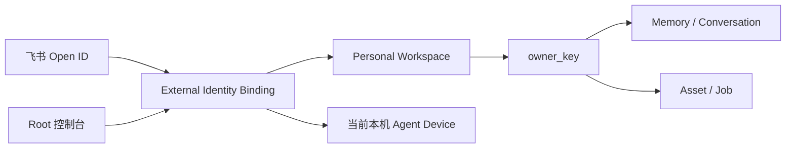
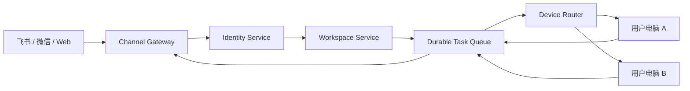

# 飞书身份、个人工作区与电脑节点绑定

作者：**Zhuofan Xie**
更新日期：2026-08-26

## 1. 结论先行

产品应采用“一个外部身份绑定一个个人工作区，工作区再绑定执行节点”的模型，而不是
为每个飞书用户复制一套 Web Agent。

当前版本已经完成第一阶段：

- `飞书 App ID + Open ID` 唯一标识一个外部身份；
- 每个外部身份自动创建独立 `workspace_id`；
- 记忆、会话、任务和资产继续使用独立 `owner_key`；
- 工作区绑定当前本机 Agent 节点；
- Root 控制台可以查看绑定并启用或停用账号；
- 沿用既有 `feishu:{app_id}:{open_id}` owner key，避免升级后丢失旧资产和记忆。

当前版本**尚未**实现飞书 OAuth 登录、普通用户 Web 门户、跨电脑中心路由和远程设备
在线状态。因此，“不同飞书账号拥有不同 Web”目前应理解为不同的数据工作区，而不是
不同域名或不同部署实例。

## 2. 为什么不能继续只用 Open ID 白名单

白名单只能回答“允许不允许调用”，不能回答：

1. 用户登录 Web 后应该看到哪个工作区；
2. 这个工作区的数据归谁、由哪台电脑执行；
3. 电脑离线时任务应该等待、迁移还是失败；
4. Root 如何暂停、撤销和审计绑定；
5. 后续接入微信、企业微信时如何把不同平台身份合并到同一个用户。

所以白名单仍保留为入口策略，但不能继续承担完整身份系统职责。

## 3. 当前架构



关键约束：

- 唯一键：`provider + app_id + external_id`；
- 同一飞书身份重复接入必须返回同一绑定，不能生成多个工作区；
- 不同 Open ID 的 `workspace_id` 和 `owner_key` 必须不同；
- `suspended` 或 `revoked` 的绑定不能执行新指令；
- Root API 只接受本机来源请求；这只是本地阶段防线，不能替代生产认证。

## 4. 数据模型

### 4.1 devices

| 字段 | 含义 |
|---|---|
| `id` | 稳定设备 ID |
| `name` | 管理员可理解的设备名称 |
| `kind` | 当前为 `local`，未来可为 desktop worker |
| `status` | 当前记录本地状态，未来由心跳维护 online/offline |

### 4.2 workspaces

| 字段 | 含义 |
|---|---|
| `id` | 个人工作区主键 |
| `name` | Root 可修改的显示名 |
| `owner_key` | 记忆、会话、资产与任务的强制隔离键 |
| `status` | 工作区生命周期状态 |

### 4.3 external_identity_bindings

| 字段 | 含义 |
|---|---|
| `provider` | 当前为 `feishu` |
| `app_id` | 飞书应用维度，避免不同应用的 Open ID 混淆 |
| `external_id` | 飞书 Open ID |
| `workspace_id` | 对应的个人工作区 |
| `device_id` | 指定执行任务的电脑节点 |
| `status` | `active / suspended / revoked` |

### 4.4 identity_audit_log

记录绑定创建、启停、撤销和工作区改名。后续应增加操作者身份、请求 ID、来源 IP 和
变更前后值，形成可检索的审计事件。

## 5. 消息执行链路

```text
飞书事件验真
  → Open ID 白名单
  → Identity Binding 解析
  → 绑定状态检查
  → workspace / owner_key 注入 Agent 上下文
  → LangGraph 规划与 Tool Policy
  → Memory、Asset、Job 均按 owner_key 查询
  → 结果回复原飞书会话
```

绑定检查是代码硬边界，不写进 Prompt。模型不能选择其他用户的 owner key，也不能绕过
停用状态。

## 6. Root 管理接口

| 方法 | 路径 | 用途 |
|---|---|---|
| `GET` | `/api/admin/identity-bindings` | 查看当前绑定 |
| `POST` | `/api/admin/identity-bindings` | 手动预创建绑定 |
| `PUT` | `/api/admin/identity-bindings/{id}/status` | 启用、停用或撤销 |
| `PUT` | `/api/admin/identity-bindings/{id}/workspace` | 修改工作区显示名 |

飞书设置弹窗会展示账号、工作区、绑定电脑和状态。保存白名单时自动建绑定，无需用户再
填写第二份 Open ID。

## 7. 生产目标架构

当产品支持多台电脑后，需要增加独立 Control Plane：



中心控制台是需要的，但应分成两种产品界面：

- **用户门户**：通过飞书 OAuth/扫码登录，只能查看自己的会话、资产、设备和任务；
- **Root 管理台**：查看全部绑定、设备在线状态、失败任务和审计记录。

飞书官方支持 Web 应用登录并获取用户身份。接入时应把飞书身份映射到内部用户，并由
本系统继续维护自己的登录 Session，而不是把 Open ID 当作登录令牌。参考
[飞书扫码登录与 OAuth 登录说明](https://open.feishu.cn/community/articles/7317091221654224898)。

## 8. 下一阶段接口与状态机

### 8.1 设备注册

```text
unregistered → pending_pairing → active → offline
                         ↘ revoked
```

桌面端首次启动生成一次性配对码；用户在已登录门户确认后，中心服务签发短期设备凭证，
再轮换为可撤销的设备证书。设备 Secret 不能放在飞书卡片或聊天消息里。

### 8.2 任务状态

```text
accepted → queued → assigned → running → succeeded
                              ↘ failed
          ↘ waiting_device → expired
```

中心服务只传递受约束的 Capability 请求，不向电脑发送任意 Shell 指令。所有外部写操作
仍经过 Tool Policy、审批和幂等账本。

## 9. 安全与隐私边界

生产上线前必须补齐：

1. Root 和用户门户的真实认证、CSRF 防护、Session 轮换与退出；
2. 所有资产文件、Viewer 链接和消息 API 的 workspace 授权；
3. 设备双向认证、短期凭证、撤销和重放保护；
4. 绑定变更二次确认与完整审计；
5. 数据导出、删除、保留期限和备份恢复；
6. 跨平台账号合并必须由用户显式确认，不能仅凭手机号或昵称猜测。

当前 Web 控制台仍是本机 Root 视图，可以查看全部飞书镜像和资产，不应直接暴露到公网。

## 10. 验收标准

- 两个 Open ID 自动得到两个不同工作区；
- 同一 Open ID 重复保存不会创建重复绑定；
- 旧用户升级后仍能看到原有记忆和资产；
- Root 停用绑定后，飞书新消息收到明确拒绝回复，工具不执行；
- 重新启用后恢复原工作区，不创建新 owner；
- 非本机来源无法调用绑定管理 API；
- 前端在 375px 宽度下无横向滚动，状态不只依赖颜色表达；
- SQLite 绑定库权限为 `0600`，不进入 Git。
