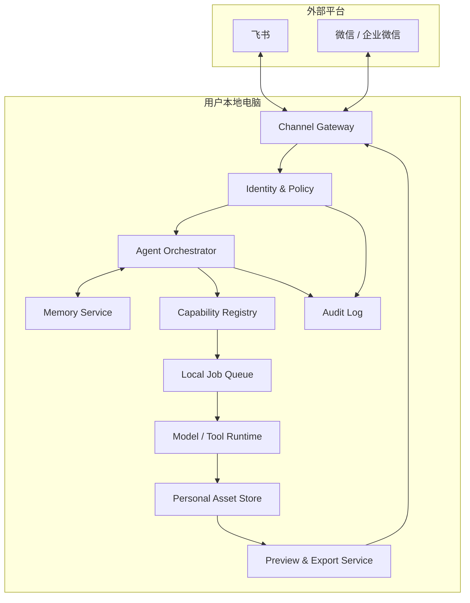
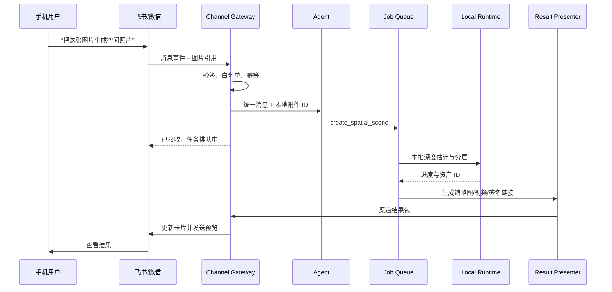

# 个人数字助手系统架构

作者：**Zhuofan Xie**  
更新日期：2026-07-27

## 1. 产品目标

用户在手机端通过飞书、微信或企业微信发送自然语言指令，家中电脑上的 Agent 接收
指令、读取记忆、调用已经安装的本地功能与模型，并把结果返回原聊天窗口。

核心原则：

- **本地执行优先**：模型、个人图片、任务资产和记忆默认保存在用户电脑；
- **聊天即入口**：手机端不要求安装完整生成应用；
- **能力可安装**：空间照片、虚拟试衣、虚拟宠物等都表现为独立 Capability；
- **异步可恢复**：耗时任务可以排队、查询、重试，并在完成后主动通知；
- **最小权限**：外部渠道只能调用已授权能力，高风险动作必须审批；
- **结果可降级**：聊天内不能实时展示 3D 时，自动提供图片、视频或安全链接。

## 2. 逻辑架构



## 3. 模块职责

### 3.1 Channel Gateway

对接不同聊天平台，并把平台事件转换为统一消息：

```text
InboundMessage
  channel
  channel_user_id
  conversation_id
  message_id
  message_type
  text
  attachments[]
  received_at
```

Channel Adapter 只负责：

- 收取和验签；
- 下载经过授权的附件；
- 发送文本、图片、文件、卡片与链接；
- 把平台用户 ID 映射为本地用户 ID；
- 用平台事件 ID / 消息 ID 做幂等。

它不包含 Agent 规划和具体模型逻辑。

### 3.2 Identity & Policy

- 允许用户和会话白名单；
- Channel 用户 ID 与本地身份绑定；
- 每个用户允许调用的 Capability；
- 速率限制、配额和最大文件限制；
- 删除、外发、支付等高风险动作的二次确认；
- 签名链接的过期时间和访问范围。

### 3.3 Agent Orchestrator

复用当前 `AgentRunner`，后续增加：

- 多轮会话状态；
- 工具循环与任务恢复；
- 记忆检索和写入策略；
- 异步任务提交后立即返回；
- 高风险工具审批；
- 结果 Presenter 选择。

### 3.4 Memory Service

记忆至少分四层：

| 层级 | 示例 | 生命周期 |
| --- | --- | --- |
| 会话记忆 | 当前对话上下文 | 会话级 |
| 用户偏好 | 常用模型、输出格式、语言 | 长期 |
| 任务记忆 | 输入、工具轨迹、结果、错误 | 长期可审计 |
| 资产记忆 | 图片、3D 资产和派生关系 | 由用户管理 |

首版使用 SQLite 即可。敏感字段加密，支持按用户查看、导出和删除，不默认把所有
对话永久保存。

### 3.5 Capability Registry

每个功能使用独立清单描述：

```yaml
id: spatial-photo
version: 0.1.0
author: Zhuofan Xie
entrypoint: create_spatial_scene
inputs:
  - image
outputs:
  - spatial-scene
runtime:
  python: ">=3.9"
  accelerator: [mps, cuda, cpu]
models:
  - id: depth-anything-v2-small
    download_size_mb: 100
permissions:
  network: model-download-only
  local_files: capability-sandbox
```

安装器未来需要校验版本、哈希、许可、依赖冲突、磁盘占用和设备能力。模型下载必须
由用户明确选择，不能由聊天中的任意文本静默触发。

### 3.6 Local Job Queue

当前空间照片已有 SQLite 任务与单工作线程。后续通用化为：

```text
queued → preparing → running → packaging → completed
                                  └──────→ failed / cancelled
```

队列需要支持：

- 进程重启后的任务恢复或明确失败；
- 进度事件；
- 并发与显存预算；
- 取消和重试；
- 任务所有者；
- 结果通知路由。

### 3.7 Preview & Export Service

根据渠道能力自动选择结果形式：

```text
image           → JPEG/WebP 预览 + 原图文件
spatial-scene   → 封面 + 视角演示 MP4 + Web Viewer 链接
3d-model        → 封面 + turntable MP4 + GLB/PLY 文件 + Viewer 链接
report          → 摘要卡片 + PDF/Markdown 文件
```

Viewer 链接必须带短时签名，不直接暴露 `backend/data` 路径。局域网模式可以要求手机
与电脑处于同一网络；远程模式需要经过认证的反向代理、隧道或中继服务。

## 4. 端到端消息时序



## 5. 当前代码与目标架构的对应关系

| 目标模块 | 当前代码 | 状态 |
| --- | --- | --- |
| Agent Orchestrator | `backend/app/agent.py` | 基础完成 |
| Capability Registry | `backend/app/tools.py` | 基础完成 |
| LLM Planner | `backend/app/llm.py` | 基础完成 |
| Job Queue | `backend/app/assets.py` | 空间照片专用 |
| Asset Store | `backend/app/assets.py` | 基础完成 |
| Web Control UI | `app/components/AgentConsole.tsx` | 完成 |
| Channel Gateway | 尚无 | 待开发 |
| Memory Service | 尚无 | 待开发 |
| Preview Export | 尚无 | 待开发 |
| Capability Installer | 尚无 | 待开发 |

## 6. 安全边界

外部聊天控制意味着“远程用户可以让本地电脑执行动作”，必须先于功能扩展建设安全层：

1. 只接受已绑定用户和允许的会话；
2. 平台事件验签，消息 ID 幂等；
3. 附件类型、大小和解压后像素限制；
4. 工具不能接受任意本地路径，只接受受控资产 ID；
5. Capability 使用独立目录和最小文件权限；
6. 模型安装、外部发送、删除和系统操作需要确认；
7. 所有工具调用写入本地审计日志；
8. 预览链接短时有效，可撤销，默认不可被搜索引擎访问；
9. API Key、Channel Secret 和签名密钥只进入系统钥匙串或加密存储；
10. 聊天内容中的提示不能修改系统权限或安装未知代码。

## 7. 分阶段路线图

### Phase 1：飞书文本闭环

- `ChannelAdapter` 接口；
- 飞书企业自建应用长连接；
- 用户白名单和消息幂等；
- 文本指令调用现有 Agent；
- 文本结果返回飞书。

### Phase 2：异步任务与空间照片

- 飞书图片附件落成本地资产；
- 任务进度卡片；
- 空间照片任务调用；
- 缩略图和视角演示视频；
- 带时效签名的 Viewer 链接。

### Phase 3：记忆

- 用户、会话、任务、偏好表；
- 会话摘要；
- 记忆查看、删除和导出；
- 资产派生关系。

### Phase 4：功能与模型库

- Capability Manifest；
- 可信来源与哈希校验；
- 模型下载确认；
- Python/Node 依赖隔离；
- 设备兼容性和资源预算；
- 安装、升级、停用和卸载。

### Phase 5：微信生态与更多能力

- 企业微信或微信公众号适配；
- 虚拟试衣、虚拟宠物、3DGS；
- 多设备协同；
- 端到端加密和远程唤醒策略。

---

Copyright © 2026 Zhuofan Xie. All rights reserved.
