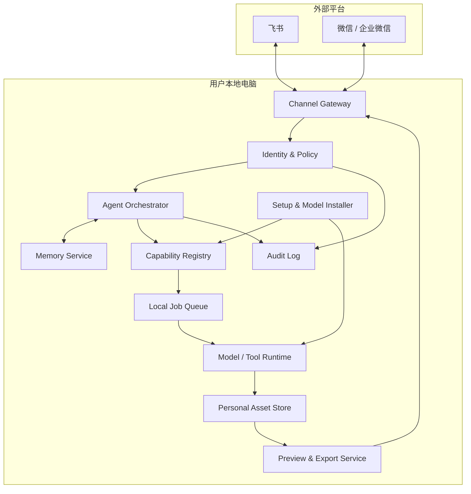
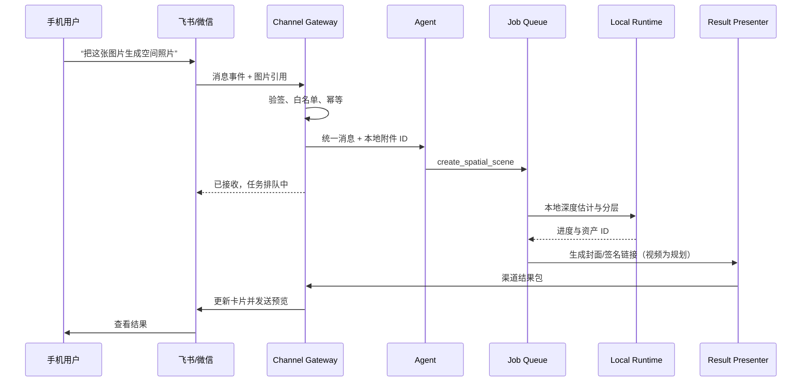

# 个人数字助手系统架构

作者：**Zhuofan Xie**  
更新日期：2026-10-08

代码核对基线：协作仓库 main@29e9865；本次为文档与源码一致性复核，非全部设备/渠道实机复测。
新手主路径见[从零复现与代码导读](../handbook/README.md)。
本文前两节描述产品目标；第 5 节记录当前代码。微信、试衣、宠物、完整视频导出等目标不等于已实现。

## 1. 产品目标

用户在手机端通过飞书、微信或企业微信发送自然语言指令，目标电脑上的 Agent 接收
指令、读取记忆、调用已经安装的本地功能与模型，并把结果返回原聊天窗口。

核心原则：

- **本地执行优先**：模型、个人图片、任务资产和记忆默认保存在用户电脑；
- **聊天即入口**：手机端不要求安装完整生成应用；
- **能力可安装**：空间照片、虚拟试衣、虚拟宠物等都表现为独立 Capability；
- **异步可恢复**：耗时任务可以排队、查询、重试，并在完成后主动通知；
- **最小权限**：外部渠道只能调用已授权能力，高风险动作必须审批；
- **结果可降级**：聊天内不能实时展示 3D 时，自动提供图片、视频或安全链接。
- **完整节点可迁移**：Web、Agent、飞书、数据和模型都在同一目标机运行；不依赖另一台
  Mac 作为固定控制或数据入口。

物理部署采用“单机完整节点、进程/容器隔离”，详见
[单机完整节点架构与迁移方案](../guides/full-node-migration.md)。

## 2. 逻辑架构


```mermaid
flowchart TB
    subgraph Cloud["外部平台"]
        F["飞书"]
        W["微信 / 企业微信"]
    end

    subgraph Device["用户本地电脑"]
        CG["Channel Gateway"]
        SEC["Identity & Policy"]
        ORC["Agent Orchestrator"]
        MEM["Memory Service"]
        REG["Capability Registry"]
        SETUP["Setup & Model Installer"]
        QUEUE["Local Job Queue"]
        RUN["Model / Tool Runtime"]
        ASSET["Personal Asset Store"]
        VIEW["Preview & Export Service"]
        AUDIT["Audit Log"]
    end

    F <--> CG
    W <--> CG
    CG --> SEC
    SEC --> ORC
    ORC <--> MEM
    ORC --> REG
    SETUP --> REG
    SETUP --> RUN
    REG --> QUEUE
    QUEUE --> RUN
    RUN --> ASSET
    ASSET --> VIEW
    VIEW --> CG
    SEC --> AUDIT
    ORC --> AUDIT
```

## 3. 模块职责

### 3.1 Channel Gateway

对接不同聊天平台，并把平台事件转换为统一消息：

```text
InboundMessage
  channel
  channel_user_id
  conversation_id
  message_id
  message_type
  text
  attachments[]
  received_at
```

Channel Adapter 只负责：

- 收取和验签；
- 下载经过授权的附件；
- 发送文本、图片、文件、卡片与链接；
- 把平台用户 ID 映射为本地用户 ID；
- 用平台事件 ID / 消息 ID 做幂等。

它不包含 Agent 规划和具体模型逻辑。

以上是目标职责划分，不是所有代码已按此拆成独立服务。当前 `feishu.py` 同时承载菜单、
附件工作流、任务监控和结果呈现；部分确定性请求直接调用本地服务，不经过 Agent 图。
后续可抽取 Gateway/Presenter/Workflow 以减少渠道与能力的耦合。

### 3.2 Identity & Policy

- 允许用户和会话白名单；
- Channel 用户 ID 与本地身份绑定；
- 每个用户允许调用的 Capability；
- 速率限制、配额和最大文件限制；
- 删除、外发、支付等高风险动作的二次确认；
- 签名链接的过期时间和访问范围。

### 3.3 Agent Orchestrator

当前 `AgentRunner` 使用八节点 LangGraph `StateGraph`：
`plan / policy / approval / execute_tool / observe / decide / finalize / fail`。
每个 Run 有独立 Checkpoint 标识；业务会话另由 SQLiteMemoryStore 管理。
首轮与续规划可使用 LLM，模型提出动作，代码检查工具、参数、风险和预算。
owner 检查还分布在身份层、Runner 和资产服务，不是全部集中于 policy。
工具相关性筛选用于成本与上下文控制，当前 policy 尚未单独检查原生 Tool Call 是否属于
本轮筛选名单；完整的角色/能力授权与允许工具集合门禁仍需补充，不能以模型 Schema 代替安全控制。
高风险 Tool 通过 interrupt 暂停，再从同一 Run 恢复；工具账本阻止不安全重放。
空间/风格化任务创建后立即移交后台，不让 LLM 循环轮询。
120 秒是节点间合作式检查，不是强制进程取消。下一阶段增加：

- 正在执行节点的进程级失败恢复；
- 单工具强制超时、取消与公平并发调度；
- 审批过期、价格版本化费用和并发预算；
- 结果 Presenter 选择。

### 3.4 Memory Service

记忆至少分四层：

| 层级 | 示例 | 生命周期 |
| --- | --- | --- |
| 会话记忆 | 当前对话上下文 | 会话级 |
| 用户偏好 | 常用模型、输出格式、语言 | 长期 |
| 任务记忆 | 输入、工具轨迹、结果、错误 | 长期可审计 |
| 资产记忆 | 图片、3D 资产和派生关系 | 由用户管理 |

当前已支持 owner/thread 隔离、结构化滚动摘要、长期 claim/evidence、时态替代关系、
敏感召回门禁、混合检索与使用反馈，并提供单条 CRUD、导出和记忆正文/扩展元数据加密。
飞书私聊和群聊分别维护上下文，长期记忆仍按用户与作用域管理；Web 当前使用 local Root。
摘要和长期记忆均为非可信上下文，不能代替审批和权限。自动保留策略、统一渠道消息事实表和
更大规模质量评测仍需补充。分层记忆主要实现人为 Xianggang Ma，
详见[分层记忆](layered-memory.md)及[教学导读](../handbook/04-memory-context-token.md)。

### 3.5 Capability Registry

每个功能使用独立清单描述：

以下 YAML 为目标契约示意，不是可直接执行的安装清单；当前 ToolSpec/CapabilityInfo 及安装白名单以源码为准。

```yaml
id: spatial-photo
version: 0.1.0
author: Zhuofan Xie
entrypoint: create_spatial_scene
inputs:
  - image
outputs:
  - spatial-scene
runtime:
  python: ">=3.9"
  accelerator: [mps, cuda, cpu]
models:
  - id: depth-anything-v2-small
    download_size_mb: 100
permissions:
  network: model-download-only
  local_files: capability-sandbox
```

当前设置中心已经实现目标机预检、安装计划、许可证确认、白名单动作、SQLite 任务、
脱敏日志、取消/重试入口与重启中断标记。模型下载必须由本机所有者明确选择，不能由
聊天中的任意文本静默触发。尚待完成模型卸载、签名制品、SBOM、自动回滚和 DGX Spark
实机档位。

### 3.6 Local Job Queue

当前空间照片与风格化已有持久化 Job/Asset、事务原子预留、worker claim/lease、
失败保留输入及用户重试；空间 queued 任务启动时可重新提交，租约过期的 running
标记中断。默认生成并发有限，不是通用分布式队列。后续通用化为：

```text
queued → preparing → running → packaging → completed
                                  └──────→ failed / cancelled
```

队列需要支持：

- 进程重启后的任务恢复或明确失败；
- 进度事件；
- 并发与显存预算；
- 取消和重试；
- 任务所有者；
- 结果通知路由。

### 3.7 Preview & Export Service

根据渠道能力自动选择结果形式：

下面为完整目标。当前已实现空间封面 + Viewer、风格化结果图/文件；
空间 MP4、3D turntable 与通用 Presenter 尚未统一实现。

```text
image           → JPEG/WebP 预览 + 原图文件
spatial-scene   → 封面 + 视角演示 MP4 + Web Viewer 链接
3d-model        → 封面 + turntable MP4 + GLB/PLY 文件 + Viewer 链接
report          → 摘要卡片 + PDF/Markdown 文件
```

当前专用 Viewer 链接带 HMAC 签名，不直接暴露 `backend/data` 路径，默认 12 小时有效、
可配置上限 7 天。签名密钥持久化不代表链接永久有效，也不提供用户登录或任意分享撤销。
Web 预览用 Three.js 双平面，手机专用链接使用轻量 CSS 分层位移，两者不是同一渲染器。
局域网模式可以要求手机
与电脑处于同一网络；远程模式需要经过认证的反向代理、隧道或中继服务。

## 4. 端到端消息时序


```mermaid
sequenceDiagram
    participant U as 手机用户
    participant C as 飞书/微信
    participant G as Channel Gateway
    participant A as Agent
    participant Q as Job Queue
    participant R as Local Runtime
    participant P as Result Presenter

    U->>C: “把这张图片生成空间照片”
    C->>G: 消息事件 + 图片引用
    G->>G: 验签、白名单、幂等
    G->>A: 统一消息 + 本地附件 ID
    A->>Q: create_spatial_scene
    G-->>C: 已接收，任务排队中
    Q->>R: 本地深度估计与分层
    R-->>Q: 进度与资产 ID
    Q->>P: 生成封面/签名链接（视频为规划）
    P->>G: 渠道结果包
    G->>C: 更新卡片并发送预览
    C->>U: 查看结果
```

## 5. 当前代码与目标架构的对应关系

| 目标模块 | 当前代码 | 状态 |
| --- | --- | --- |
| Agent Orchestrator | `backend/app/agent.py`、`backend/app/orchestration.py` | 八节点有界循环、独立 Run Checkpoint、审批恢复、执行账本、异步移交；待强制取消、公平并发和费用版本 |
| Capability Registry | `backend/app/tools.py`、`models.py` | Tool Schema 子集校验、风险/审批/幂等声明、Capability 信息；待细粒度角色授权、超时和市场版本治理 |
| LLM Planner | `backend/app/llm.py` | OpenAI-compatible MVP；供应商兼容性待评测 |
| Job Queue | `backend/app/assets.py`、`style_transfer.py` | 两类任务持久化、原子预留/claim、lease、中断/用户重试；HTTP 幂等覆盖不完整，通用队列和 Outbox 待完成 |
| Asset Store | `backend/app/assets.py` | owner 隔离与受控文件读写，专用 Viewer 签名已实现；Root HTTP 用户认证与 workspace 授权仍待完成 |
| Web Control UI | `app/components/AgentConsole.tsx` | Web 会话列表和消息已改为服务端 SQLite 唯一数据源；飞书仍为渠道日志只读镜像 |
| Channel Gateway | `backend/app/feishu.py`、`channel_settings.py` | 文本、多图/草稿、空间封面/Viewer、风格化结果图/文件、卡片与短重试；统一 Adapter、Outbox 和视频待实现 |
| Memory Service | `backend/app/memory.py`、`context.py`、`retrieval.py` | 分层记忆、claim/evidence、摘要、混合检索、加密、CRUD/导出；待统一渠道事实表与保留策略 |
| Preview Export | `backend/app/lan_viewer.py`、`app/components/SpatialViewer.tsx` | 签名手机 CSS Viewer 与 Web Three.js；待固定公网交付、身份化分享和通用视频导出 |
| Capability Installer | `backend/app/capability_setup.py`、`scripts/deploy.py` | 预检、计划、许可、白名单动作、持久化进度、重试/取消、验证；待升级/卸载/回滚与完整设备验收 |
| Token/Operations | `backend/app/token_usage.py`、`observability.py` | 阶段用量、actual/estimate 区分、可选 Run 预算、健康/Ready/JSON 指标；待费用、长期监控和告警 |

从当前代码逐阶段走向目标架构的学习、实现和验收顺序见
[工程手册](../handbook/README.md)；原有长期学习规划见
[从零到可运行个人数字助手](../learning/implementation-roadmap.md)。

## 6. 安全边界

外部聊天控制意味着“远程用户可以让本地电脑执行动作”，必须先于功能扩展建设安全层：

以下是安全目标，不是所有项均已完成。当前 Web 仍是本机 Root，签名 Viewer 为持有者访问；
未来用户认证、链接撤销、全局限流、完整红队与生产审计需要独立交付。

1. 只接受已绑定用户和允许的会话；
2. 平台事件验签，消息 ID 幂等；
3. 附件类型、大小和解压后像素限制；
4. 工具不能接受任意本地路径，只接受受控资产 ID；
5. Capability 使用独立目录和最小文件权限；
6. 模型安装、外部发送、删除和系统操作需要确认；
7. 所有工具调用写入本地审计日志；
8. 预览链接短时有效，可撤销，默认不可被搜索引擎访问；
9. API Key、Channel Secret 和签名密钥只进入系统钥匙串或加密存储；
10. 聊天内容中的提示不能修改系统权限或安装未知代码。

## 7. 分阶段路线图

### Phase 1：飞书文本闭环

- `ChannelAdapter` 接口；
- 飞书企业自建应用长连接；
- 用户白名单和消息幂等；
- 文本指令调用现有 Agent；
- 文本结果返回飞书。

### Phase 2：异步任务与空间照片

- 飞书图片附件落成本地资产；
- 任务进度卡片；
- 空间照片任务调用；
- 缩略图和视角演示视频；
- 带时效签名的 Viewer 链接。

### Phase 3：记忆

- 用户、会话、任务、偏好表；
- 会话摘要；
- 记忆查看、删除和导出；
- 资产派生关系。

### Phase 4：功能与模型库

- Capability Manifest；
- 可信来源与哈希校验；
- 模型下载确认；
- Python/Node 依赖隔离；
- 设备兼容性和资源预算；
- 安装、升级、停用和卸载。

### Phase 5：微信生态与更多能力

- 企业微信或微信公众号适配；
- 虚拟试衣、虚拟宠物、3DGS；
- 多设备协同；
- 端到端加密和远程唤醒策略。

---

Copyright © 2026 Zhuofan Xie. All rights reserved.
