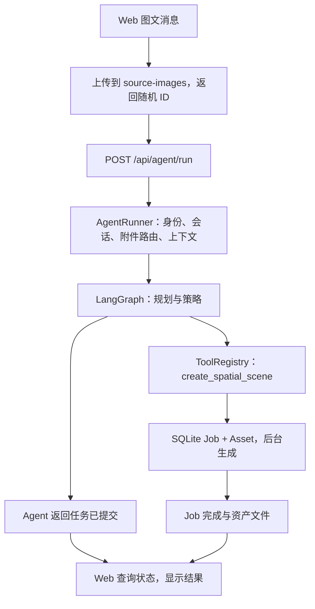

# 2. 一次请求的完整执行与语义处理

文档整理：**Zhuofan Xie** · 2026-10-08

[返回主目录](README.md)

## 2.1 从同一个例子开始

用户上传猫图，说：“把这张图生成空间照片。”



关键分工：模型建议调用哪个工具；后端决定有没有权限、参数是否合法、如何执行；
图像网络只承担深度/分割或生成，不负责聊天身份和任务队列。

## 2.2 你在 UI 点的按钮，代码中在哪

| 操作 | 网页入口 | 后端入口/关键符号 |
| --- | --- | --- |
| 发送对话/上传图片 | [AgentConsole](../../app/components/AgentConsole.tsx) | [main.py](../../backend/app/main.py)：stage_source_image、run_agent |
| 新建/删除会话 | AgentConsole | main.py：create_conversation、delete_conversation |
| 修改 LLM | [ModelSettingsDialog](../../app/components/ModelSettingsDialog.tsx) | [settings.py](../../backend/app/settings.py)、main.py：save_llm_settings |
| 查看工具库 | [ToolLibrary](../../app/components/ToolLibrary.tsx) | [tools.py](../../backend/app/tools.py)：ToolRegistry；main.py：list_capability_manifests |
| 空间照片工作台 | [SpatialStudio](../../app/components/SpatialStudio.tsx) | [assets.py](../../backend/app/assets.py)：SpatialSceneService |
| 图片风格化工作台 | [PhotoStyleStudio](../../app/components/PhotoStyleStudio.tsx) | [style_transfer.py](../../backend/app/style_transfer.py)：PhotoStyleService |
| 设置与安装 | [SetupCenter](../../app/components/SetupCenter.tsx) | [capability_setup.py](../../backend/app/capability_setup.py)：CapabilitySetupService |
| 飞书设置/消息 | [FeishuSettingsDialog](../../app/components/FeishuSettingsDialog.tsx)、[ChannelMessageTimeline](../../app/components/ChannelMessageTimeline.tsx) | [feishu.py](../../backend/app/feishu.py)、[channel_settings.py](../../backend/app/channel_settings.py) |

启动时 [main.create_app()](../../backend/app/main.py) 创建注册表、服务、Planner、AgentRunner、
渠道和 Viewer，并在 `lifespan` 中启动/关闭资源。不是 React 页面直接执行 Python 模型。

## 2.3 五个 ID 不要混淆

| ID | 含义 | 常见错误 |
| --- | --- | --- |
| owner_id | 资源/记忆属于谁 | 把客户端传入 ID 当可信身份 |
| thread_id/session_id | 哪个会话上下文 | 用同一个默认 thread 接收所有群用户 |
| source_image_id | 暂存的输入图 | 把它误当生成结果资产 ID |
| run_id | 一次 Agent 编排 | 把 Run 完成当作图像生成完成 |
| job_id / asset_id | 后台任务 / 结果资产 | 只拿结果链接、不保留任务状态 |

Web API 目前由后端使用 `WEB_OWNER_ID="local"`，不是让用户提交任意 owner。
飞书通过 [IdentityBindingRegistry](../../backend/app/identity.py) 将应用/Open ID 映射到工作区；
线程再区分渠道、聊天和用户。部署文档不能把这描述成已完成 Web 登录。

## 2.4 语义不是一次八分类，而是三层处理

1. **确定性命令**：清空、记住、审批、菜单等由代码识别，避免每次请 LLM 猜。
2. **附件角色**：单图/多图、内容图/参考图、普通视觉问答/生成请求。
3. **受限工具规划**：向 LLM 提供选中的工具 Schema，返回 Tool Call 或回答。

查看 [agent.py](../../backend/app/agent.py)：
`_is_memory_command()`、`_route_image_attachments()`、
`_looks_like_image_generation_followup()`、`AgentRunner.run()`；
查看 [context.py](../../backend/app/context.py)：`ToolSelector.select()`。

项目没有一个已训练并评测的“8 类意图识别网络”。不要用面试概念表代替真实实现。
规则适合明确命令，LLM 适合开放语义；规则有误匹配风险，LLM 有幻觉风险，两者都需要测试。
工具筛选只控制发给模型的候选上下文，不等于完整授权；当前门禁边界见
[工具调用与安全说明](03-agent-loop.md#33-tool-call-在代码中是什么)。

## 2.5 “刚才那张图”怎么解析

当本轮没有新附件且消息像图像生成追问时，Runner 读取同一会话近期附件。
有多张图片或角色不明确时先澄清，而不是随机取第一张。读文件仍须校验 owner 和存在性。

普通“这张图里有什么”可将受限图片作为瞬时视觉请求交给启用的 VLM；
明确生成空间照片/风格化时，规划上下文以图片 ID、角色和尺寸为主，由本地工具读取原图。

视觉图片不写进 Checkpoint/长期记忆不代表完全不落盘：暂存图和预览仍在本机，
默认启动清理会删除超过 24 小时的暂存目录。这不是严格的实时 TTL 删除。
相应测试见 [test_context.py](../../backend/tests/test_context.py) 的
`test_real_planner_sends_vision_parts_without_persisting_image_data`；
视觉模型的真实供应商能力仍需单独测试。

## 2.6 不经过网页也可以看见一次 Run

macOS/Linux（服务已启动）：

```bash
curl -fsS http://127.0.0.1:8000/api/agent/run \
  -H 'Content-Type: application/json' \
  -d '{"message":"现在几点？","session_id":"handbook-demo"}'
```

查看 `run_id`、`status`、`steps`、`token_usage`。Demo 或真实模型的措辞可能不同，
但都不应仅凭回答文本判断工具是否真的执行。请求契约见
[AgentRunRequest / AgentRunResponse](../../backend/app/models.py)。

阅读真实接口时可以在 /docs 里填写相同参数；不要把用户 owner、数据库路径或模型路径放进请求冒充权限。

## 2.7 如何沿一条调用链读源码

按以下顺序查符号，而不是从头阅读几千行：

```text
main.run_agent
→ AgentRunner.run
→ SQLiteMemoryStore.context / ContextBuilder.build
→ LangGraphOrchestrator.invoke / _plan / _policy
→ ToolRegistry.validate_call / execute
→ register_asset_tools 中的 create_spatial_scene handler
→ SpatialSceneService.create_scene_from_source / _process
→ Job API / Web 展示 / 飞书 Presenter
```

练习：同一任务分别记下 run_id、job_id、asset_id。
在 Agent 已返回但 Job 仍 running 时，解释为何这是正常状态，而不是“模型假完成”。

[下一章：Agent 循环](03-agent-loop.md) · [返回主目录](README.md)
