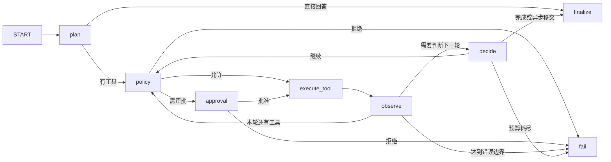

# 3. 八节点 Agent、工具决策与审批恢复

文档整理：**Zhuofan Xie** · 2026-10-08

[返回主目录](README.md)

## 3.1 先分清模型、框架与产品代码

- LLM：根据消息和允许的工具定义提出回答或 Tool Call。
- LangGraph：承载状态、节点、条件边、Checkpoint 和 interrupt。
- 本项目：自行定义节点职责、参数/权限校验、预算、账本和用户体验。

Function Calling 与 Workflow 不是二选一：前者表达模型想执行的动作，后者决定何时允许执行、
执行后去哪、失败如何处理。现代 LangChain 也能实现 Agent，不能说“LangChain 只能线性链”；
本项目选择显式 StateGraph 是为了把业务控制流写清楚。参考
[LangGraph Graph API](https://docs.langchain.com/oss/python/langgraph/graph-api)。

## 3.2 实际八节点，不是八次模型调用



| 节点 | 做什么 | 关键源码 |
| --- | --- | --- |
| plan | 用受限上下文/Schema 得到首轮计划 | _plan |
| policy | 名称、参数、步数/时间检查，读取风险和审批声明 | _policy |
| approval | interrupt 暂停；恢复后读取批准/拒绝 | _approval |
| execute_tool | 账本准备、调用 handler、保存结果或错误 | _execute_tool |
| observe | 汇总观察、工具次数、连续错误、剩余调用 | _observe |
| decide | 判断完成/继续；异步图像任务优先移交 | _decide |
| finalize | 整理最终状态和已得到的回答 | _finalize |
| fail | 返回稳定的停止原因 | _fail |

均在 [orchestration.py](../../backend/app/orchestration.py) 的
`LangGraphOrchestrator` 中；先读 `__init__()` 的边，再读节点函数。

首轮与续规划可调用模型；答案合成也可能在 decide 内触发。
`_finalize()` 本身不重新请求模型。不要说“只有 plan 用 LLM，其他全部不调用模型”。

## 3.3 Tool Call 在代码中是什么

模型返回结构化的“工具名＋参数”，而不是直接执行 Python：

```json
{
  "name": "create_spatial_scene",
  "arguments": {"source_image_id": "<本轮合法图片ID>", "title": "猫咪空间照片"}
}
```

[ToolCall](../../backend/app/models.py) 是内部模型；
[ToolRegistry](../../backend/app/tools.py) 保存声明和 handler，`openai_schemas()`
转成兼容接口格式，`validate_call()` 做本项目支持的参数校验。

这里的 Schema 校验是项目手写子集，不应宣称支持 JSON Schema 全规范。
owner 检查分布在 Runner、身份层及服务读写中，不是全部集中在一个“万能 policy 节点”。

还要区分“少给模型一些工具”和“禁止它执行其他工具”：`ToolSelector` 是相关性/成本筛选。
当前原生 Tool Call 解析后，policy 校验注册表中的名称与参数，但没有单独强制检查名称是否在
本轮 `selected_tool_names` 中。因此筛选名单不能被当作安全授权边界。
生产化应补充本轮允许工具集合、用户角色/能力授权的代码门禁，并测试模型返回未授权工具的负例。
源码对照：[llm.py](../../backend/app/llm.py) 的 `_resolve_tool_calls()` 与 policy。

## 3.4 安全边界为什么写在代码里

默认配置由 [AgentRunner.__init__](../../backend/app/agent.py) 和 Orchestrator 构造器传入：

| 边界 | 目的 | 易误解处 |
| --- | --- | --- |
| 最多 4 次工具执行 | 避免无限调用 | 不等于只有 4 个图节点 |
| 最多 3 次重规划 | 控制续规划 | 不等于 3 条用户消息 |
| 连续错误最多 2 次 | 避免盲目重试 | 成功观察会影响连续错误统计 |
| 120 秒运行检查 | 超时后不再继续图流程 | 节点之间合作式检查，不保证堵塞的模型调用 120 秒被杀 |
| recursion_limit | 图层最后保险 | 与业务步数不是同一计数 |

阅读 `_hard_boundary_error()`、`_runtime_error()` 和 `_observe()`。
模型说“继续”不能覆盖这些边界。真正强制超时还需单工具超时、取消信号或隔离进程退出。

## 3.5 有界循环为什么在项目中有价值

纯单步“图片 → 模型 → 文件”完全可以不用 LangGraph。
必要性来自多个状态：信息不足需澄清、结果不足需换工具、高风险需审批、重启后需恢复。

先跑确定性测试看循环，而不是让随机 LLM 恰巧表现一次：

```bash
.venv/bin/python -m pytest backend/tests/test_orchestration.py -q \
  -k 'replans_after_observation or step_budget or invalid_tool_arguments'
```

Windows 将执行器换成 `.\.venv\Scripts\python.exe`。

测试里的 `ReplanningPlanner` 先执行 increment，观察结果后再规划，最后结束；
它是测试夹具，不是给用户增加的业务能力。读
[test_orchestration.py](../../backend/tests/test_orchestration.py) 对应测试，
你应能指出哪条条件边返回 policy、在哪次观察后完成。

## 3.6 审批与恢复怎么实现

风险声明在 `ToolSpec.requires_approval`；审批节点调用 `interrupt(payload)`。
Web/飞书决策进入 Runner，再用相同 Run 对应的 Checkpoint 配置和 `Command(resume=...)` 恢复。

Checkpoint 的 thread 标识由 `checkpoint_thread_id(context, run_id)` 生成，
不能只用聊天 session_id 让所有 Run 共用一个可覆盖状态。源码见
[orchestration.py](../../backend/app/orchestration.py)：
`resume()`、`_validate_snapshot_identity()`、`checkpoint_thread_id()`。

为什么有执行账本：中断恢复可能重走节点，副作用不能依靠“模型不会重复”。
完成结果可以复用；非幂等动作执行结果不明时停止自动重放，等待人工核对。
这是项目代码补出的业务约束，不是 Checkpoint 自动提供 exactly-once。

参考：
[Persistence](https://docs.langchain.com/oss/python/langgraph/persistence)、
[Interrupts](https://docs.langchain.com/oss/python/langgraph/interrupts)。

## 3.7 异步移交是一条重要的确定性路径

图像 handler 返回 `job_id + asset_id` 后，`_async_job_handoff()` 让 Agent 立即返回“已提交”；
Web/飞书任务监控接管状态查询与最终交付。

这样不必让 LLM 在图循环里每隔几秒调用状态工具，避免无意义 Token 和重规划。
Run 完成、Job running 可以同时成立，参见测试
`test_async_visual_job_hands_off_without_model_polling`。

## 3.8 练习

1. 参数错误在哪阻止？图片 owner 错误又在哪阻止？
2. 为什么审批恢复需要原 Run 配置，而不是新建一次 Run？
3. 如果运行停在外部写操作之后、账本完成之前，应如何处理？
4. 为什么本项目现阶段无需先上 Multi-Agent？

[下一章：记忆与 Token](04-memory-context-token.md) · [返回主目录](README.md)
