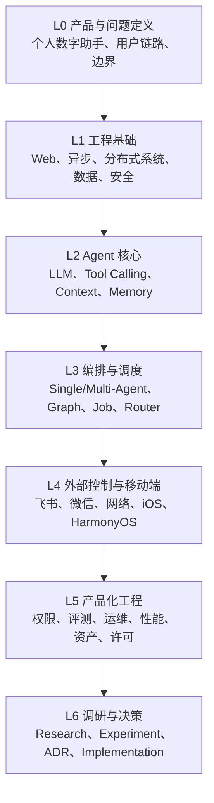

# 个人数字助手知识库

作者：**Zhuofan Xie**
更新日期：2026-07-28
状态：路线 A–D 核心正文与实战主线已建立；路线 E 仅保留大纲

本目录是项目的系统化学习入口。目标不是收集零散教程，而是建立从工程基础、
Web Agent、外部控制到产品化落地的完整知识结构，并把学习成果连接到调研、实验、
ADR 和代码实现。

## 1. 知识库与其他文档的边界

| 文档类型 | 回答的问题 | 入口 |
| --- | --- | --- |
| 学习资料 | 原理是什么，应该掌握哪些概念 | 当前知识库 |
| 技术调研 | 当前有哪些方案，优缺点是什么 | [技术调研](../research/) |
| 实验记录 | 方案在本项目和设备上的真实表现 | [实验记录](../experiments/README.md) |
| 技术决策 | 项目最终选择什么，为什么 | [ADR](../decisions/README.md) |
| 任务状态 | 谁在做，做到哪一步 | [调研与实现中心](../project-board.md) |

学习资料不直接把框架宣传写成项目结论。会变化的能力、价格、许可和平台规则必须在
调研文档中核对版本和日期；需要实测的结论必须进入实验记录。

本轮正文的资料检索与访问日期统一为 **2026-07-28**。正文优先引用标准组织、平台
官方文档、框架官方文档/仓库和原始论文；无法由来源直接证明的内容均表述为“项目
建议”“待实验”或“待 ADR”，不作为既成事实。

## 2. 从哪里开始

如果目标是“从零学到能实现”，不要逐页阅读所有知识地图：

1. 先读[项目工程基础](foundations/00-project-engineering.md)，运行当前项目；
2. 按[从零到可运行个人数字助手](implementation-roadmap.md)逐阶段实践；
3. 每个阶段只回到相应分域补齐原理；
4. 需要比较方案时进入 Research/Experiment，决定后写 ADR；
5. 用[调研证据与文档维护方法](research-quality.md)判断结论是否充分。

知识地图用于建立全貌和查漏，实战路线用于规定实现顺序和阶段验收；二者不能互相替代。

## 3. 总体知识层级

## 4. 分域导航

| 分域 | 核心问题 | 大纲入口 | 当前状态 |
| --- | --- | --- | --- |
| 工程与 AI 基础 | 后续内容依赖哪些 Web、异步、数据、安全和 LLM 基础 | [基础知识地图](foundations/README.md) | 核心正文已核对 |
| Web Agent | Agent 如何理解、规划、调用工具、调度和恢复 | [Web Agent 知识地图](web-agent/README.md) | 核心正文已核对 |
| 外部控制 | 飞书、微信和手机如何安全控制本地 Agent | [外部控制知识地图](external-control/README.md) | 核心正文已核对，PoC 待做 |
| AI 功能与模型 | 空间照片、试衣、宠物、图像、视频和端侧模型如何选择 | [AI 功能知识地图](ai-capabilities/README.md) | 按要求仅保留大纲 |
| 产品化工程 | 如何把 Demo 变成安全、可维护、低功耗的产品 | [产品工程知识地图](product-engineering/README.md) | 核心正文已建立，基线待测 |
| 术语与概念 | 跨文档术语如何保持一致 | [术语表](glossary.md) | 核心定义完成 |

辅助入口：

- [从零到可运行个人数字助手](implementation-roadmap.md)：学习、代码、测试和验收主线；
- [调研证据与文档维护方法](research-quality.md)：证据等级、完整性审查和更新触发器。

## 5. 推荐学习路线

### 路线 A：从零理解 Web Agent

1. 工程基础中的 HTTP、异步和数据存储；
2. LLM API、消息、Token 和 Context；
3. Structured Output 与 Tool Calling；
4. Agent Loop 与 ReAct；
5. Single Agent；
6. 状态、记忆和 Durable Execution；
7. 安全、评测和可观测性；
8. 最后学习 Multi-Agent 与框架选型。

### 路线 B：Agent 架构与调度

1. Agent 架构模式；
2. Single Agent 与 Multi-Agent 边界；
3. 请求、工作流、Agent、模型和资源调度；
4. LangChain；
5. LangGraph；
6. 自研、LangChain、LangGraph 和其他框架对比；
7. 使用统一任务进行对照实验；
8. 形成 Agent 架构 ADR。

### 路线 C：外部聊天控制

1. Webhook、WebSocket、长连接和 Bot API；
2. OAuth、Token、验签、身份和幂等；
3. Channel Adapter；
4. 飞书；
5. 微信、企业微信、公众号和小程序；
6. NAT、隧道、中继和远程唤醒；
7. iOS、HarmonyOS 和 Android 限制；
8. 图片、视频、3D 与安全 Viewer 回传。

### 路线 D：从 Demo 到可用产品

1. 权限、Prompt Injection 和附件安全；
2. 任务队列、重试、取消与恢复；
3. Trace、指标、日志和失败回放；
4. Capability、MCP 和插件生命周期；
5. 模型许可、供应链和数据治理；
6. 多模态资产；
7. 常驻服务、更新、备份和恢复；
8. 性能、功耗和移动端降级。

### 路线 E：AI 功能与模型选型

1. 模型任务、输入输出和约束定义；
2. 深度、分割、姿态和修复；
3. LDI、Mesh、NeRF、3DGS 和 Viewer；
4. 2D/3D 虚拟试衣与数字人；
5. 宠物重建、骨骼、动作和桌面运行；
6. 图像编辑、材质、视频和插帧；
7. 端侧部署、量化、功耗和许可；
8. 统一基准、Capability 和 ADR。

## 6. 内容成熟度

| 状态 | 含义 |
| --- | --- |
| `大纲` | 只有知识边界、章节和学习目标 |
| `初稿` | 已有核心概念，但资料和示例不完整 |
| `已核对` | 主要事实已由官方文档或论文核对 |
| `待实验` | 原理完整，但项目适用性需要实测 |
| `已验证` | 已有本项目实验或代码验证 |
| `需更新` | 上游框架、平台、价格或许可发生变化 |

## 7. 正文建设顺序

### 第一批：必须先掌握

- [x] Web、异步和分布式系统基础；
- [x] 项目环境、依赖、配置、测试和调试基础；
- [x] LLM API、Structured Output 与 Tool Calling；
- [x] Agent Loop、Single Agent 和状态模型；
- [x] Agent 调度与 Durable Execution；
- [x] 安全、权限、评测和可观测性；
- [x] 外部消息平台接入基础；
- [x] OAuth/OIDC/PKCE、账号绑定和设备身份基础。

### 第二批：项目近期需要

- [x] LangChain；
- [x] LangGraph；
- [x] Single Agent 与 Multi-Agent 对比；
- [x] Google ADK、Pydantic AI 与 Microsoft Agent Framework；
- [x] MCP、A2A 与 AG-UI；
- [x] 飞书长连接；
- [x] 微信与企业微信官方路径；
- [x] iOS、HarmonyOS 与 Android 部署限制；
- [x] 远程网络与结果预览。

### 第三批：产品化和扩展

- [x] Capability、MCP 和插件生命周期；
- [ ] 空间照片、虚拟试衣、虚拟宠物和生成模型选型；
- [ ] 模型路由、成本与本地推理；
- [x] 多模态资产与 3D 预览；
- [x] 数据治理和许可证；
- [x] 性能、能耗与常驻服务；
- [x] Human-Agent UX。

勾选表示“已形成可学习正文”，不表示相关项目实现、平台 PoC 或设备实验已经完成。
模型选型相关项属于路线 E，按本轮要求仍不扩写。

## 8. 当前审查结论

- 架构层级清晰，已经覆盖从工程基础到产品化的主要知识域；
- Agent 架构、调度和现代框架覆盖较全面，但最终选型仍缺同任务横评；
- 外部控制总体链路合理，飞书证据较充分，微信和 HarmonyOS 仍是部分调研；
- 原文更像“知识地图”，缺少从代码基线逐步实现的连续路径，本轮已新增阶段路线；
- Route E 按计划仍是大纲，不能把整个知识库描述为“所有模型方向均已调研”；
- 完整审查、已核验更新和证据缺口见
  [调研证据与文档维护方法](research-quality.md)。

## 9. 新增正文的规则

1. 从[主题写作模板](topic-template.md)创建正文。
2. 一个文件只回答一个明确问题。
3. 中文为主，API、模型和标准保留英文名称。
4. 标注作者、更新日期、成熟度和关联任务 ID。
5. 明确区分官方事实、项目实测、工程推断和项目决策。
6. 优先引用官方文档、论文、官方仓库和模型卡。
7. 把动态信息的核对日期写入正文。
8. 正文完成后更新本页、所属分域导航和项目看板。

---

Copyright © 2026 Zhuofan Xie. All rights reserved.
