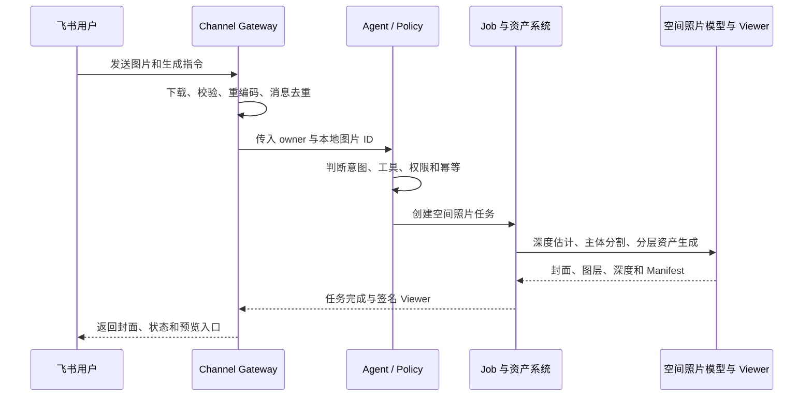
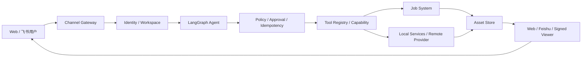

# 个人数字助手项目阶段汇报

汇报人：**Zhuofan Xie**

汇报基线：`main@bf21762`（[PR #15](https://github.com/CarrieX6/Personal-digital-assistant---A-Web-Agent/pull/15) 已合并）

审计日期：2026-09-04

文档状态：内容初稿，待真实设备数据与汇报场景确认

建议时长：15 分钟正文 + 10 分钟问答

> 归属声明：图片风格化和分层长短期记忆由 **Xianggang Ma** 实现，只作为团队已有
> 能力和协作成果介绍，不计入 Zhuofan Xie 的个人工作成果。合并、回归验证和文档整理
> 不改变功能实现归属。

## 一、汇报大纲

### 第 1 页：项目定位——我们想把电脑上的 AI 能力带到手机聊天窗口

回答：项目为谁解决什么问题，最终产品形态是什么。

### 第 2 页：阶段目标——本阶段不是堆功能，而是验证三条关键链路

回答：本阶段要验证什么，以及什么叫阶段成功。

### 第 3 页：阶段结果——已经从网页 Demo 走到跨端可运行闭环

回答：当前真正做成了什么，哪些结果已有代码、测试或真实运行证据。

### 第 4 页：用户故事——一张图片如何从飞书进入本地电脑并返回空间照片

回答：用户实际如何使用，以及端到端链路给用户带来什么价值。

### 第 5 页：系统架构——用一个受控 Agent 串起渠道、模型、任务与结果

回答：系统如何工作，为什么采用本地优先、单 Agent 与 Capability 解耦架构。

### 第 6 页：我的关键贡献——不是做了多少页面，而是解决了四类系统问题

回答：Zhuofan Xie 独立或主导解决的关键问题、采用的判断及产生的结果。

### 第 7 页：团队协作——让不同成员开发的能力进入同一个产品框架

回答：团队如何分工，图片风格化与记忆能力如何归属，项目怎样避免贡献混淆。

### 第 8 页：结果证据——系统能运行，但距离产品可用还有明确数据缺口

回答：测试、运行、跨端和安全方面有什么证据，哪些指标尚未建立。

### 第 9 页：问题与判断——当前最大的风险不是模型不够多，而是可靠性与产品化

回答：为什么暂时不继续堆新功能，真正阻碍上线的 P0/P1 问题是什么。

### 第 10 页：下一阶段——从可演示系统走向可交付产品

回答：接下来做什么、怎么验收、需要哪些资源，以及完成后的产品状态。

## 二、各板块主线

### 2.1 贯穿全场的故事

1. **问题**：个人电脑已经能运行越来越多 AI 能力，但普通用户很难在离开电脑时安全、
   连续地调用这些能力。
2. **假设**：如果把聊天软件作为控制入口，把电脑作为执行节点，再由受控 Agent 负责
   理解、调度和反馈，就能把分散的模型变成随时可用的个人服务。
3. **验证**：本阶段以空间照片为代表能力，打通了“飞书发图—本地处理—任务追踪—手机
   预览”的端到端链路，并建立了身份、工具、资产和恢复基础。
4. **结果**：项目已经从单个网页 Demo 演进为可跨端运行的增强型 MVP，但还没有达到
   无人值守、可规模部署的产品标准。
5. **下一步**：优先补可靠性、安全、跨平台部署和可观测性，再扩展更多 AI 能力。

### 2.2 每页的核心结论与承接关系

| 页码 | 听众必须记住的一句话 | 与下一页的承接 |
| --- | --- | --- |
| 1 | 我们不是再做一个聊天页面，而是在构建“手机发指令、个人电脑执行”的本地 AI 助手。 | 既然目标是跨端执行，就要先验证最关键的产品假设。 |
| 2 | 本阶段只验证三件事：Agent 会不会正确调度、手机能不能远程控制、结果能不能在手机消费。 | 接下来用已经完成的结果回答这三件事。 |
| 3 | 三条关键链路已经形成闭环，项目从网页原型进入增强型 MVP。 | 抽象结论之后，用一次真实用户任务说明系统价值。 |
| 4 | 用户只需在飞书发一张图，电脑端即可自动生成并返回可交互空间照片。 | 这条看似简单的体验，需要一个受控而非自由失控的 Agent 架构。 |
| 5 | 系统的核心不是某个模型，而是把消息、身份、决策、工具、任务、资产和结果连成可靠闭环。 | 架构价值最终要落到我具体解决了哪些关键问题。 |
| 6 | 我的主要工作是打通和约束系统链路，而不是把同事开发的模型能力算作个人成果。 | 系统还包含其他成员交付的能力，需要明确协作边界。 |
| 7 | Xianggang Ma 实现图片风格化和分层长短期记忆；统一接口让团队能力可以进入同一产品。 | 分工清楚之后，必须用数据说明当前完成度。 |
| 8 | 代码和自动化测试证明“链路可运行”，但真实设备稳定性和用户体验指标仍不完整。 | 数据缺口决定下一阶段不能继续无边界堆功能。 |
| 9 | 当前主要矛盾已从“有没有功能”转向“能否可靠、安全、低成本地长期运行”。 | 因此下一阶段以产品化门槛而不是功能数量作为目标。 |
| 10 | 完成可靠性、安全、Windows 和远程服务验收后，项目才从可演示系统进入可交付产品。 | 以明确里程碑、指标和资源请求结束汇报。 |

### 2.3 讲述节奏

- **前 3 分钟**：第 1–3 页，快速建立问题、目标和结果；
- **中间 7 分钟**：第 4–7 页，用用户故事、架构和贡献说明“结果是怎么来的”；
- **后 5 分钟**：第 8–10 页，展示证据、承认边界并给出下一阶段计划；
- 技术细节只在问答时进入附录，不在正文逐个讲类、函数或提交记录。

## 三、逐页内容与讲稿

### 第 1 页：项目定位——我们想把电脑上的 AI 能力带到手机聊天窗口

**本页核心结论**

个人数字助手不是一个新的聊天网页，而是一条“手机下达任务、个人电脑安全执行、结果
回到手机”的本地 AI 服务链路。

**页面内容**

- **用户问题**：模型和个人数据在电脑上，但用户离开电脑后无法方便调用；不同 AI
  功能又分散在不同页面、脚本和运行环境中。
- **产品设想**：用户只面对飞书等熟悉的聊天入口，Agent 在电脑端完成理解、调度、
  执行、跟踪和回传。
- **核心价值**：降低使用门槛、复用本地算力、减少私人图片外传，并让新能力能够按
  Capability 持续接入。
- **当前边界**：这是本地优先的增强型 MVP，不是已经能够无人值守执行任意任务的通用
  智能体。

**建议图示**

```text
手机聊天窗口  ──自然语言/图片──>  个人电脑 Agent  ──调用──>  本地 AI 能力
手机查看结果  <──卡片/图片/Viewer── 任务与资产系统 <──结果──  模型与工具
```

**口头讲稿**

> 这个项目最初从空间照片等单点 AI 功能出发，但我发现真正影响使用的不是再增加一个
> 模型，而是用户离开电脑后就无法调用它。因此项目目标调整为：把聊天软件变成控制端，
> 把个人电脑变成执行节点，再用一个受控 Agent 串起本地模型、任务和结果。用户不需要
> 理解模型部署，只需要像发消息一样使用自己的电脑能力。

---

### 第 2 页：阶段目标——本阶段不是堆功能，而是验证三条关键链路

**本页核心结论**

本阶段用一个代表性视觉任务验证 Agent 调度、外部控制和移动端结果消费三项产品假设。

**页面内容**

| 要验证的假设 | 阶段成功标准 | 当前结论 |
| --- | --- | --- |
| Agent 能正确调度 | 能识别任务、选择受限工具、执行后判断是否结束，失败时不会无限循环 | `已形成代码闭环`：8 节点 LangGraph、Schema/Policy 校验和硬停止条件已实现 |
| 手机能远程控制电脑 | 飞书文本或图片能进入正确用户的本地工作区，并创建任务 | `局部验证`：文本实租户链路曾接通；媒体自动化闭环完成，仍缺系统性真机回归 |
| 结果能在手机消费 | 不只回复“任务完成”，还要返回图片或可交互结果 | `MVP 已实现`：空间照片可返回封面和签名 Viewer；固定公网域名尚未完成 |

**阶段定义**

- 不是以“接入多少模型”为完成标准；
- 以一条端到端用户链路是否可运行、可失败、可恢复、可验证为完成标准；
- 当前结论是**增强型 MVP**，不是生产可用版本。

**口头讲稿**

> 我把本阶段范围压缩成三个问题。第一，Agent 是否真的会根据状态调工具，而不是模型
> 直接生成一段看似正确的话；第二，用户能否在手机上触发家中电脑；第三，结果能否在
> 手机上真正使用。空间照片同时包含图片输入、本地模型、长任务和交互结果，所以适合
> 作为这三项假设的联合验证任务。

---

### 第 3 页：阶段结果——已经从网页 Demo 走到跨端可运行闭环

**本页核心结论**

项目已经具备跨端增强型 MVP 的主要骨架，但“链路跑通”与“长期稳定可用”仍需明确区分。

**结果数据卡**

| 指标 | 当前结果 | 证据含义 |
| --- | ---: | --- |
| 用户入口 | 2 类 | Web Root 控制台、飞书聊天入口 |
| 已注册 Agent 工具 | 8 个 | 文本、时间、能力查询、个人资产、空间照片、任务状态和团队图片能力 |
| Agent 图节点 | 8 个 | Plan、Policy、Approval、Execute、Observe、Decide、Finalize、Fail |
| 后端回归 | 206/206 通过 | 2026-08-31 在当前分支重新执行；另有 3 个依赖弃用警告 |
| 前端门禁 | 构建通过，SSR 1/1 通过 | 现有两条页面路由可完成构建和服务端渲染；仍有大 Chunk 警告 |
| 启动入口 | macOS/Linux + Windows | Shell 与 PowerShell 均有脚本；Windows 真实设备仍待验收 |

**已经形成的产品闭环**

1. Web/飞书消息能够进入 Agent；
2. Agent 通过 Tool Registry 调用能力，并经过参数、owner、风险和幂等边界；
3. 空间照片以异步任务执行，失败可保留原始输入并重试；
4. 结果进入个人资产库，可在 Web 查看，也可通过签名 Viewer 在手机预览；
5. Root 控制台能查看跨渠道消息和需要处理的任务。

**不能从这些数据推出的结论**

- 206 个测试通过不等于飞书长连接已经达到 7×24 小时稳定；
- 有 Windows 启动脚本不等于 NVIDIA 环境已经真机兼容；
- Viewer 能打开不等于弱网、不同手机和飞书内置浏览器都已通过；
- 功能已接入不等于真实模型质量已经达到产品标准。

**口头讲稿**

> 结果上，项目已经不再是只有一个网页按钮的 Demo。它现在有两个入口、八个工具和
> 八节点受控 Agent，并通过了 206 个后端测试和前端构建。但我不会把这些工程数字直接
> 等同于产品可用：真实断网、Windows GPU、弱网 Viewer 和持续运行仍然缺少数据。这也
> 是后面下一阶段计划的依据。

---

### 第 4 页：用户故事——一张图片如何从飞书进入本地电脑并返回空间照片

**本页核心结论**

用户只需要发图和表达目标，复杂的本地处理、任务状态和结果交付由系统完成。

**用户操作**

1. 用户在飞书向机器人发送一张 JPG、PNG 或 WebP 图片；
2. 用户表达“生成空间照片”，或通过功能卡片进入该能力；
3. 电脑端创建异步任务并回复处理状态；
4. 任务完成后返回封面和带签名的 Viewer 链接；
5. 用户在手机上拖动或使用设备方向传感器查看视差效果。

**系统内部链路**



**结果价值**

- 用户不需要打开电脑、复制文件或手动运行模型；
- LLM 只接触受控资产 ID，图片文件由本地工具读取；
- 图片任务和资产带 owner，不能由模型自行切换到其他用户；
- 失败任务可复用已经规范化的本地输入进行重试。

**当前体验限制**

- 空间照片是基于深度和图层的 2.5D 视差，不应宣传为完整可环绕 3D；
- 开发期 Viewer 使用局域网或临时隧道，链接可用性依赖电脑在线；
- 固定域名、分享撤销、访问审计和统一手机兼容测试尚未完成。

**口头讲稿**

> 对用户来说，这条链路只有“发一张图”和“打开结果”两步。系统内部则完成消息下载、
> 安全校验、Agent 决策、异步任务、深度估计、主体分割、资产保存和签名预览。这里的
> 关键不是展示多少后台模块，而是这些模块共同消除了用户手动操作电脑和模型的成本。

---

### 第 5 页：系统架构——用一个受控 Agent 串起渠道、模型、任务与结果

**本页核心结论**

系统的核心竞争力不是某个模型，而是让不同渠道和 AI 能力在同一套身份、安全、任务与
结果协议下可靠运行。

**架构图**



**三个关键架构判断**

1. **本地优先，而不是手机端直接跑所有模型**

   手机负责交互，电脑负责模型、数据和长任务；这样兼顾算力、隐私和设备限制。

2. **受控 Single Agent，而不是直接引入 Multi-Agent**

   当前主要问题是可靠工具执行，不是多个角色讨论。一个受控图更容易建立权限、幂等、
   恢复和可观测基线。

3. **Agent 与 Capability 解耦**

   Agent 负责理解和调度，CV/生成模型作为工具或独立 Provider；新功能不需要重写整个
   对话系统。

**代码硬边界**

- 默认最多 4 个工具执行步骤；
- 最多 3 次重新规划；
- 连续 2 次错误触发停止；
- 高风险工具进入审批节点；
- 工具调用前校验存在性、Schema、owner、风险和幂等；
- Checkpoint 用于恢复执行，不等同于产品会话数据。

**口头讲稿**

> 我没有让大模型直接拥有电脑权限，而是把它限制在 Plan 节点。模型负责提出下一步，
> 代码负责判断这个工具是否存在、参数是否合法、用户是否有权限、操作是否需要审批，
> 并在达到步数或错误上限后强制停止。这样做牺牲了一部分“完全自由”，换来了可解释、
> 可恢复和可上线的工程边界。

---

### 第 6 页：我的关键贡献——不是做了多少页面，而是解决了四类系统问题

**本页核心结论**

我的主要贡献是把单点视觉功能组织成可远程控制、可约束、可恢复的 Agent 产品链路。

**贡献一：确定产品方向并搭建首个完整骨架**

- 从空间照片单功能出发，明确“聊天控制端 + 本地 Agent 节点 + Capability”的产品形态；
- 搭建 Web 工作台、FastAPI、LLM Provider 配置、Tool Registry、资产任务和空间照片首版；
- 形成从用户输入到本地视觉结果的首个闭环。
- 代码证据：`08a48fb`，项目初始化及首版 Agent、空间照片和系统架构。

**贡献二：把一次性 Tool Calling 改造成受控 Agent 循环**

- 将模型限制在规划节点，Policy、执行、观察、决策和失败处理由代码负责；
- 增加最大步数、重规划、连续错误、审批和幂等边界；
- 让“调用工具”从一次函数请求演进为可追踪的任务执行过程。
- 代码证据：`b5d33c1` 中的 Agent 编排与渠道基线；不包含 Xianggang Ma 后续实现的
  分层长短期记忆成果。

**贡献三：打通飞书图片到空间照片的跨端链路**

- 建立飞书配置、白名单、消息去重、图片下载、状态回复和媒体结果回传；
- 增加空间照片失败重试、个人资产缩略图、手机 Viewer 和链接刷新；
- 增加飞书身份到本机 Workspace/owner 的绑定与状态拦截。
- 代码证据：`9c862e5`、`009ec83`、`5bb66cb`。

**贡献四：建立可协作、可审计的工程机制**

- 建立统一调研与实现看板、实验和 ADR 模板；
- 创建多人 Git Skill，把领取、分支、PR、验证、合并清理和看板同步写入流程；
- 建立 Capability 接入、飞书配置、媒体能力和设备部署文档。
- 代码证据：`6b64421`、`6e32590` 及后续指南。

**贡献产生的结果**

| 从 | 到 |
| --- | --- |
| 只能在电脑网页点击功能 | 可以从飞书发送指令和图片 |
| LLM 一次性决定工具 | 受控图循环、审批、停止和失败状态 |
| 图片结果只在本机可见 | 手机获得封面、文件或交互 Viewer |
| 单人临时修改 | 有看板、任务、分支、PR、实验和归属规则 |

**口头讲稿**

> 如果只看页面数量，很难说明我的贡献。我主要解决的是四类系统问题：先确定产品链路，
> 再让 Agent 的工具调用可控，然后打通飞书到本地视觉任务的跨端闭环，最后建立多人协作
> 和证据机制。图片风格化和分层长短期记忆是同事的成果，这里不计入我的个人贡献。

---

### 第 7 页：团队协作——让不同成员开发的能力进入同一个产品框架

**本页核心结论**

团队协作的价值不是把所有功能算到一个人名下，而是让不同成员交付的能力遵循统一接口、
安全边界和用户体验。

**贡献边界**

| 成员/来源 | 主要成果 | 在汇报中的归属 |
| --- | --- | --- |
| Zhuofan Xie | 产品与 Agent 骨架、飞书外部控制、空间照片链路、身份与工程治理 | 个人成果，经代码和提交继续审计 |
| Xianggang Ma | 图片风格化 Capability、SDXL + IP-Adapter 链路、分层长短期记忆与混合召回 | Xianggang Ma 的个人成果，只在团队成果页介绍 |
| 第三方开源 | LangGraph、Depth Anything V2、BiRefNet、Three.js、Diffusers 等 | 基础依赖，不归属任何团队成员原创 |

**协作后系统获得的能力**

- 图片风格化和空间照片可以通过同一聊天入口、工具库、资产和任务体验被用户调用；
- 记忆可以在现有身份和会话边界中提供上下文，但其核心设计和实现归 Xianggang Ma；
- 能力接入开始具备 Manifest、依赖、权限、Provider、部署和验收说明；
- 看板现在明确区分实现人、合并人、验证人和文档维护人。

**协作原则**

```text
实现某项能力 ≠ 合并该分支 ≠ 回归测试 ≠ 整理文档
```

四类工作都有价值，但阶段汇报和个人述职必须分别记录。

**口头讲稿**

> 这个项目开始进入多人协作后，最容易出现的问题是把“代码现在在我的分支里”误认为
> “这是我实现的”。因此这次审计重新校准了归属：图片风格化和分层长短期记忆由
> Xianggang Ma 实现。我的工作是围绕自己负责的 Agent、飞书、空间照片和工程边界讲清
> 结果，同时说明团队能力如何通过统一接口组合成产品。

---

### 第 8 页：结果证据——系统能运行，但距离产品可用还有明确数据缺口

**本页核心结论**

当前证据足以证明工程闭环成立，但不足以证明系统已经达到生产稳定性和规模化能力。

**已获得的硬证据**

| 证据类型 | 结果 | 能证明什么 |
| --- | --- | --- |
| 后端自动化回归 | 206/206 通过 | API、Agent、飞书 Fake、身份、Viewer、空间分割等代码路径没有已知回归 |
| 前端门禁 | Build 通过，SSR 1/1 通过 | Web 控制台当前能够构建并服务端渲染 |
| Agent 结构 | 8 个图节点，默认最多 4 步、3 次重规划、2 次连续错误 | 运行边界由代码约束，不依赖 Prompt 自觉停止 |
| 工具注册 | 8 个已注册工具 | 文本、资产、空间照片、任务和团队能力通过统一 Registry 暴露 |
| 跨平台入口 | Shell、PowerShell | 已考虑 macOS/Linux 与 Windows 启动形式 |
| 空间照片性能基线 | 20 次平均 5.030 s，P95 7.584 s，20/20 完成 | 本机 M4 受控图片集的工程耗时和阶段瓶颈已有量化基线 |
| 飞书响应基线 | 23 条入站至首条出站记录 P95 1191.1 ms | 本机消息接收、持久化和首响已有实际事件时间戳证据 |
| Git 证据 | PR、Commit、看板和实验记录 | 功能来源、状态和贡献归属可以追溯 |

**目前缺少的产品数据**

| 缺失指标 | 为什么重要 | 建议验证方法 |
| --- | --- | --- |
| 飞书消息端到端成功率 | 决定用户是否敢把任务交给机器人 | 固定 50 条文本、图片、卡片任务，记录接收、执行和回传成功率 |
| 断网/休眠恢复时间 | 家用电脑会频繁休眠和换网 | 20 次断网、睡眠、唤醒实验，记录自动恢复时间和消息丢失 |
| 空间照片跨设备 P50/P95 | 当前只有 M4 本机首轮基线，不能代表 Windows/CPU-only | 在固定图片集上分设备复测冷启动、热启动和并发 |
| Viewer 手机兼容率 | 结果必须在真实手机可消费 | iOS/Android、飞书内置浏览器和系统浏览器交叉测试 |
| 任务完成率与重试率 | 仅看 API 通过无法反映真实失败 | 为 Job 建立成功、失败、重试、取消和超时指标 |
| CPU/GPU/内存/功耗 | 决定能否长期驻留和设备分级 | 固定任务集采集峰值、稳态和任务后回收数据 |

**证据分级原则**

- `A 级`：真实用户/真实设备重复验证；
- `B 级`：自动化测试或本机可重复实验；
- `C 级`：代码已经存在但没有目标环境验证；
- `D 级`：只有设计或计划。

正文中的“已完成”原则上必须达到 A 或 B 级；C、D 级必须写明边界。

**口头讲稿**

> 当前最硬的工程证据包括 206 个后端测试、前端构建与 SSR，以及首轮真实性能基线：
> M4 上 20 次空间照片平均 5.030 秒、P95 7.584 秒，23 条飞书事件首响 P95 约 1.19 秒。
> 这说明链路和本机耗时已经可以量化，但样本规模、Windows/CPU-only、断网恢复、真实
> 成功率和手机兼容率仍不充分，不能把首轮基线包装成生产 SLA。

---

### 第 9 页：问题与判断——当前最大的风险不是模型不够多，而是可靠性与产品化

**本页核心结论**

继续增加虚拟试衣、宠物或更多模型，会扩大维护面；当前应先解决会阻止真实用户长期使用
的可靠性、安全和部署问题。

**P0：不解决就不能面向真实用户**

1. Web 控制台仍是本机 Root 全局视图，缺少正式登录和资源级授权；
2. 飞书长连接缺少断网、休眠、网络切换和消息补偿的系统实验；
3. 渠道回复尚未形成完整 Outbox、退避、死信和对账机制；
4. Viewer 缺少固定域名、可撤销分享、访问审计和稳定 HTTPS；
5. 图片和资产的保留、删除、备份与隐私策略尚未产品化。

**P1：影响跨设备和规模化**

1. Windows + NVIDIA 尚未完成真实设备安装和连续任务验证；
2. 空间照片仍是进程内服务，缺少远程 GPU Provider 和资产对账协议；
3. Web 与飞书消息还没有完全迁入统一 Message/Attachment 模型；
4. 缺少任务、模型、渠道、延迟和资源的统一可观测指标；
5. Capability 还不能真正做到签名安装、升级、回滚和卸载。

**阶段判断**

```text
当前最优策略：减少新增功能数量，提升一条核心链路的成功率和可交付性。
```

虚拟试衣、虚拟宠物、3DGS 等功能保留在路线图，但不进入下一阶段 P0。

**口头讲稿**

> 现在最容易做的是继续增加展示效果很强的新模型，但这会掩盖真正的问题：电脑休眠后
> 飞书是否恢复、任务失败后消息是否补发、其他用户能否看到不属于自己的资产、Windows
> 能否一键安装。公司要的是可交付结果，所以我建议先把一条链路做稳，再扩大功能面。

---

### 第 10 页：下一阶段——从可演示系统走向可交付产品

**本页核心结论**

下一阶段以可靠性指标和跨设备交付为完成标准，而不是以新增功能数量为标准。

**里程碑一：可靠单机版**

- 完成 Web Root 登录、Session 和资源级 owner 授权；
- 建立飞书 Outbox、断线补偿、任务通知和失败对账；
- 建立固定 50 条端到端任务集与失败样本库；
- 完成 iOS/Android Viewer 真机矩阵。

建议退出指标：

- 固定任务集端到端成功率目标 `≥95%`；
- 非幂等副作用重复执行 `0 次`；
- 20 次断网/休眠实验均能恢复，目标恢复时间 `≤60 秒`；
- Viewer 核心操作在目标手机矩阵通过率目标 `≥95%`。

**里程碑二：跨平台与远程算力版**

- 在一台 Windows + NVIDIA 电脑完成从零安装、空间照片和连续任务验证；
- 抽象 `SpatialSceneProvider`，支持本机 CUDA 或受保护的远程 GPU；
- 建立模型清单、固定版本、哈希、许可和可恢复卸载；
- 记录 P50/P95、显存、内存、功耗和任务后回收。

建议退出指标：

- 新设备按文档一次部署成功；
- 远程任务支持幂等、超时、取消、哈希校验和 owner 对账；
- 设备不满足资源要求时能明确降级或拒绝，不静默失败。

**里程碑三：可发布产品版**

- 固定域名、可撤销 Viewer、访问审计和数据删除；
- 统一 Channel、Message、Attachment、Job 和 Capability 接口；
- 增加运行监控、版本升级、回滚和用户帮助；
- 再根据真实用户数据选择虚拟试衣、宠物或其他下一项能力。

**所需资源**

| 资源 | 用途 |
| --- | --- |
| Windows + NVIDIA 测试机 | 安装、CUDA、显存与连续任务验收 |
| 飞书企业测试环境和多测试账号 | 单聊、群聊、权限、断网和身份隔离实验 |
| 固定域名与受控 HTTPS | 稳定 Viewer、撤销、审计和移动端预览 |
| 可选远程 GPU | 验证电脑无独立显卡时的 Provider 路线 |
| iOS 与 Android 真机 | Viewer、内置浏览器、传感器和弱网测试 |

**结束语**

> 本阶段证明了产品方向和端到端链路可行；下一阶段要证明它能被真实用户稳定、安全、
> 低门槛地长期使用。

## 四、技术审计附录

附录用于回答技术追问，不占用正文汇报时间。

### 附录 A：项目模块状态

| 模块 | 当前状态 | 已有结果 | 未完成边界 |
| --- | --- | --- | --- |
| Web Root 控制台 | 增强型 MVP | 图文会话、跨渠道记录、任务处置、工具库与配置 UI | 正式登录、用户门户、资源级授权 |
| Agent Orchestrator | 局部产品化 | 8 节点图、Policy、审批、幂等、Checkpoint 和硬停止 | 强制单工具超时、审批过期、费用预算、统一评测 |
| 飞书 Channel | 开发中 | 文本、图片、卡片、白名单、去重、重连状态和结果回传 | 真实断网矩阵、Outbox、死信、Webhook/SSE 级进度 |
| 身份与 Workspace | P0 基础完成 | Open ID 到独立 Workspace/owner、本机 Root 管理和状态拦截 | OAuth 门户、多电脑路由、资产级授权 |
| 空间照片 | MVP | Depth Anything V2、语义主体分割、双层资产和 Three.js Viewer | 质量基准、背景补全、高质量 LDI/3D、Windows 实测 |
| Viewer | 开发中 | HMAC 签名、文件白名单、触控、设备方向和手机尺寸适配 | 固定域名、撤销、审计、弱网与真机矩阵 |
| Job/Asset | 局部实现 | SQLite、文件资产、状态、空间照片重试和原子抢占 | 通用 Job、取消、进程级恢复、对象存储和生命周期 |
| 图片风格化 | 团队能力，开发中 | Xianggang Ma 实现本机/独立 Provider、Web/飞书链路 | 真实 MPS、第二台 Windows、质量和功耗门禁 |
| 分层长短期记忆 | 团队能力，已验收 | Xianggang Ma 实现分层、摘要、混合召回与安全边界 | 产品持续指标和新增渠道回归仍需维护 |
| 跨平台部署 | 局部实现 | Shell、PowerShell、依赖预检和图片能力部署管理器 | Windows 真机、守护、升级、回滚和签名制品 |

### 附录 B：个人贡献证据矩阵

| 成果 | 主要证据 | 汇报口径 |
| --- | --- | --- |
| 项目首版 Agent、空间照片和系统架构 | `08a48fb` | 可作为 Zhuofan Xie 的个人成果 |
| Agent 编排与飞书渠道基线 | `b5d33c1` 中的 orchestration/channel 代码与测试 | 只主张 Agent 和渠道部分，不主张 Xianggang Ma 后续记忆增强 |
| Viewer 与飞书媒体可靠性 | `9c862e5` | 可作为跨端工程成果 |
| 空间照片失败重试与消息体验 | `009ec83` / PR #8 | 可作为可靠性与 UX 成果 |
| 飞书媒体、身份绑定、空间分割 | `5bb66cb` / PR #11 | 可作为跨端、安全和空间照片成果 |
| 调研中心和 Git 协作流程 | `6b64421`、`6e32590` | 可作为工程治理成果 |
| 图片风格化 | Xianggang Ma 相关实现和实验 | 不计入 Zhuofan Xie 个人成果 |
| 分层长短期记忆 | Xianggang Ma 分支及 PR #12 | 不计入 Zhuofan Xie 个人成果 |

> 说明：Git 的最终合并作者只能证明谁执行了合并，不能单独证明谁设计和实现功能。
> 贡献结论综合任务负责人、原始分支、代码内容、实验作者和团队确认。

### 附录 C：Agent 图和停止边界

```text
START
  ↓
plan ──无工具──> finalize ──> END
  ↓
policy ──高风险──> approval
  ↓                  ↓
execute_tool <───────┘
  ↓
observe ──继续执行──> policy
  ↓
decide ──重新规划──> plan
  ├──完成──> finalize ──> END
  └──越界/失败──> fail ──> END
```

| 边界 | 当前默认值 | 目的 |
| --- | ---: | --- |
| 最大工具步骤 | 4 | 防止无边界执行和 Token/费用失控 |
| 最大重新规划 | 3 | 防止模型在失败路径反复尝试 |
| 连续错误上限 | 2 | 及时停止已明显失效的工具链 |
| 图递归限制 | 根据步骤和重规划次数由代码计算，且不低于 25 | 防止 LangGraph 结构性死循环 |
| 写工具幂等 | owner + 稳定 idempotency key | 防止恢复或消息重放造成重复副作用 |

### 附录 D：空间照片技术边界

当前路线不是从单图恢复完整真实三维场景，而是生成可交互 2.5D 资产：

1. `Depth Anything V2 Small` 估计单目相对深度；
2. macOS 优先 Apple Vision，跨平台使用 BiRefNet，失败时再降级到深度蒙版；
3. 将完整主体与背景拆分，生成前景、背景、深度、蒙版、封面和 Manifest；
4. Three.js 根据深度或分层偏移渲染视差；
5. 鼠标、触控或设备方向只改变虚拟视角，不是让二维前景做简单平移；
6. 遮挡区域来自单张图片推断，因此大视角移动仍会暴露拉伸、空洞或补全伪影。

上传安全边界包括 20 MB 文件上限、4000 万像素解码上限、图片重编码和输出最长边
1600 像素；这些值是工程保护参数，不代表产品性能已经完成优化。

### 附录 E：验证记录

本次汇报文档制作期间重新执行：

```text
Backend: 206 passed, 3 warnings
Frontend: production build passed
SSR: 1 passed, 0 failed
```

2026-09-04 发布分支新增统一部署封装后，专项复验结果为：

```text
Deployment-focused backend tests: 30 passed
Frontend: production build passed
SSR: 1 passed, 0 failed
Lint: 未完成，依赖读取长时间无输出后人工中止
```

三个后端警告来自当前依赖的弃用提示：Starlette TestClient、protobuf UTC 时间和飞书
SDK 事件循环初始化。它们没有导致本次测试失败，但应登记为升级技术债。前端存在大于
500 kB 的 Chunk 警告，需要后续按页面和重组件做代码分割。

### 附录 F：首轮性能量化

完整口径与边界见
[空间照片与飞书链路性能基线](../experiments/perf-001-spatial-feishu-baseline-2026-09-03.md)。

- 空间照片 20 次平均 5.030 秒、P95 7.584 秒，热启动 19 次平均 4.783 秒；
- 首次冷启动生成 9.719 秒，进程启动至首次完成 9.872 秒；
- 进程峰值 RSS 697.52 MiB；MPS `current allocated` 232.76 MiB；
- 分层、遮挡补全和 WebP 编码占热启动耗时约 80.7%，是当前主要瓶颈；
- 23 条飞书入站至首条出站记录平均 939.2 ms、P95 1191.1 ms；
- 2 条完整空间任务早期确认平均 0.904 秒、最终 Viewer 卡片平均 15.675 秒。

这些结果是受控工程基线，不是生产承诺；项目标准 `.venv` 的 PyTorch 冷导入异常、跨设备
差异、功耗和真实失败率仍需补测。

### 附录 G：汇报前演示检查

- 使用无个人隐私的固定测试图片；
- 确认 Web、Backend、Viewer 和飞书长连接状态；
- 预先完成一次空间照片生成并保留录屏作为网络失败时的降级材料；
- 不在屏幕上展示 App Secret、Open ID 全值、API Key、本地数据库或私人资产路径；
- 实时演示控制在 2 分钟内，超时后切换到预生成结果；
- 明确说明图片风格化和分层长短期记忆由 Xianggang Ma 实现；
- 问答时根据附录回答，不在正文临时展开代码细节。
