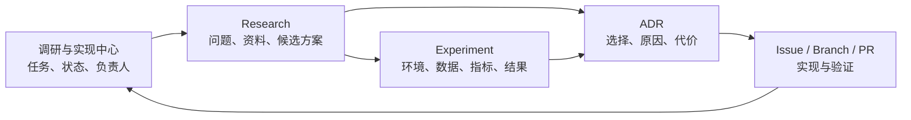

# 调研、实验与技术决策流程

作者：**Zhuofan Xie**
更新日期：2026-07-27

本流程用于确保项目中的模型选择、系统架构和平台接入结论具有可追溯证据，并能转化
为可验收的开发任务。

## 1. 文档关系



- [调研与实现中心](../project-board.md)是唯一的项目级状态总览。
- 调研文档记录问题、证据、候选方案和调研过程。
- 实验记录保存可复现的环境、输入、命令、原始结果和分析。
- ADR 只记录已经作出的技术选择及其后果。
- Issue、分支和 PR 负责实现，不替代调研与决策文档。

## 2. 标准流程

### 阶段 A：登记与领取

1. 在总看板登记唯一任务 ID、优先级、依赖和验收目标。
2. 填写负责人，避免多人重复研究同一问题。
3. 使用独立分支；存在 GitHub Issue 时同步记录负责人和计划范围。
4. 从[调研模板](research-template.md)创建文档。

### 阶段 B：界定问题

明确：

- 用户或工程问题；
- 当前实现和已知缺陷；
- 必须满足的约束；
- 不在本次调研范围内的内容；
- 需要作出的具体决策；
- 完成标准。

不要以“研究一下某模型”作为问题。应写成可以形成选择的问题，例如：
“在 16GB Apple Silicon 设备上，哪种单目深度模型能够在可接受质量下降内，将单张
1600px 图片的处理时间控制在目标范围内？”

### 阶段 C：资料调研

资料优先级：

1. 官方文档、API 参考和模型卡；
2. 原始论文及补充材料；
3. 官方代码仓库、Release 和许可证；
4. 可复现的独立基准；
5. 社区讨论，只用于发现问题，不单独支撑关键结论。

记录访问日期、版本、Commit、模型 checkpoint 和许可证。价格、模型能力、平台权限
等会变化的信息必须注明核对日期。

### 阶段 D：候选方案筛选

至少对比：

- 功能和输入输出；
- 质量与已知失败类型；
- 模型参数、权重体积和依赖；
- CPU、MPS、CUDA 或移动端支持；
- 延迟、内存、显存、功耗和温度；
- 是否离线、是否上传个人数据；
- API 或硬件成本；
- 许可证和商业使用条件；
- 集成复杂度、维护活跃度和供应商锁定；
- 与当前代码的改造范围。

没有实测的数据标记为“上游报告”或“工程推断”，不得写成项目实测结果。

### 阶段 E：原型与实验

出现以下情况时必须实验：

- 候选方案质量接近；
- 上游基准与本项目设备或数据不一致；
- 涉及视觉质量、LLM 成功率、端侧性能或功耗；
- 需要验证 SDK 权限、平台限制、断线恢复或真实回调；
- 结论依赖尚未验证的工程假设。

使用[实验模板](../experiments/experiment-template.md)，保存环境、版本、输入数据规则、
命令、指标、原始结果、失败样本和分析。不得提交包含个人隐私或无授权数据的测试集。

### 阶段 F：技术决策

满足以下条件时创建 ADR：

- 影响两个及以上模块；
- 引入长期依赖、云服务、模型或数据格式；
- 存在明显迁移成本；
- 涉及安全、隐私、许可证或付费；
- 团队未来可能追问“为什么这样选”。

使用 [ADR 模板](../decisions/ADR-template.md)，明确选择、未选择方案、原因、代价、
回退方式和重新评估条件。

### 阶段 G：实现与复盘

1. 把决策拆成可以独立验收的 Issue。
2. 在 PR 中关联调研、实验和 ADR。
3. 完成测试、文档和性能基线。
4. 合入后更新总看板的实现状态。
5. 上游模型、价格、许可或平台规则变化时，将状态改为 `🔁 需更新`。

## 3. 模型调研的最低交付标准

模型选型文档至少包含：

| 类别 | 必填内容 |
| --- | --- |
| 身份 | 模型名、版本、checkpoint、发布日期、来源 |
| 能力 | 任务、输入输出、分辨率、语言或模态 |
| 质量 | 公共指标、本项目测试集、主观评分规则、失败样本 |
| 性能 | 权重、下载、峰值内存/显存、预热和推理时间 |
| 能耗 | 测量设备、运行时长、平均/峰值功耗或可获得的替代指标 |
| 部署 | CPU/MPS/CUDA/移动端、量化、离线与依赖 |
| 数据 | 输入是否上传、日志保存、隐私边界 |
| 成本 | API 单价、设备成本、存储与带宽 |
| 许可 | 代码许可、权重许可、训练数据风险、商业限制 |
| 工程 | 集成工作量、维护状态、锁定风险、回退方案 |

## 4. Agent 与平台调研的最低交付标准

Agent 或渠道方案至少验证：

- 正常任务闭环；
- 工具参数错误；
- 模型输出无效；
- 超时、重试和取消；
- 进程重启恢复；
- 重复消息幂等；
- 未授权用户；
- Prompt Injection 或恶意附件；
- 外部平台断线和限流；
- 结果过大或不支持预览；
- 审计、删除和数据导出。

## 5. 命名与维护

推荐路径：

```text
docs/research/<domain>/<TASK-ID>-<slug>.md
docs/experiments/<domain>/<TASK-ID>-YYYY-MM-DD-<slug>.md
docs/decisions/ADR-NNNN-<slug>.md
```

文档使用中文为主，模型名、API 和代码保持原文。需要国际协作时增加英文摘要或独立
英文版本，并确保两种语言指向同一任务 ID 和 ADR。

每次更新保留当前有效结论，不通过复制文件制造多个互相冲突的版本。被新决策替代的
ADR 标记为 `Superseded`，不要删除历史。

---

Copyright © 2026 Zhuofan Xie. All rights reserved.
