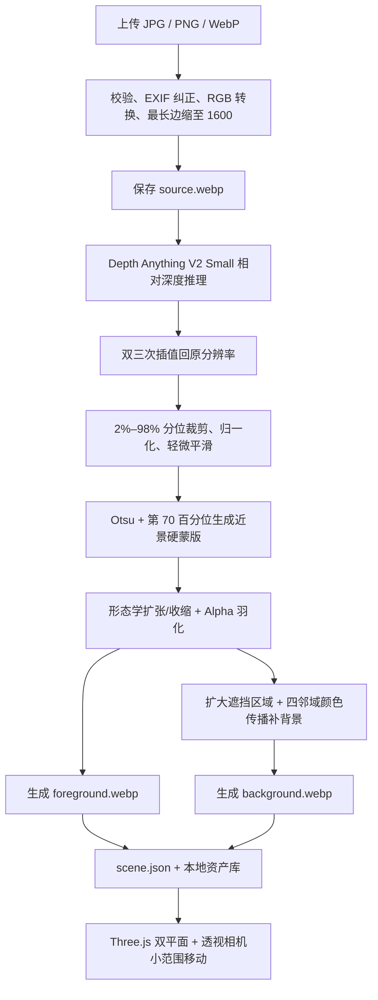
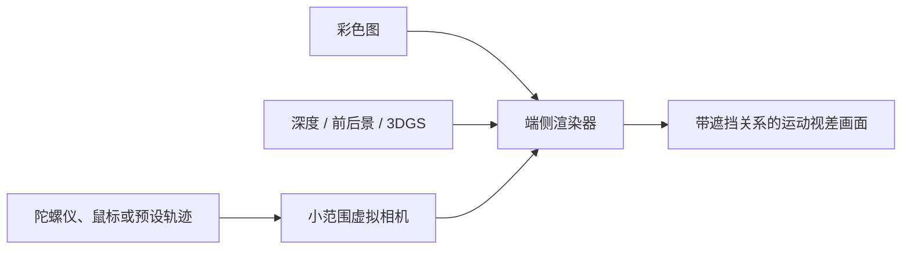

# 空间照片端侧部署与资产格式技术文档

作者：**Zhuofan Xie**  
更新日期：2026-07-24

## 1. 目标与结论

本文说明本项目生成的 RGB 图、深度图和前后景图层，如何在 Web、手机、电脑及
系统锁屏场景中使用。

核心结论如下：

1. **深度图本身不会产生视角变化。**运动视差需要“彩色图 + 深度或多层几何 +
   交互输入 + 实时渲染器”共同工作。
2. 当前资产可以直接用于本项目 Web Viewer，也适合封装成 Android 动态壁纸；
   但不能把 `depth.png` 单独设成 iPhone、macOS 或 Windows 的系统锁屏。
3. iOS 26 的“空间场景”锁屏由系统从合格的普通照片自行生成。目前可核实的公开
   API 中，没有面向普通第三方应用、允许把自定义深度图直接注册为 iOS 空间锁屏
   的接口。
4. macOS 的内置动态锁屏主要是航拍视频过渡，不是用户单图加深度的实时视差。
   自定义交互效果需要屏幕保护程序或独立渲染应用。
5. 不存在跨 iOS、Android、macOS、Windows 通用的“3D 锁屏图片格式”。项目应
   定义自己的空间资产包，由各端适配器读取；无法运行实时渲染器的平台则导出
   静态图或循环视频作为降级版本。

## 2. 当前项目资产

每个空间场景当前包含：

```text
scene.json
source.webp       原始彩色图的安全重编码版本
depth.png         8-bit 相对深度，白色表示较近
foreground.webp  带透明通道的近景层
background.webp  遮挡区域经过补全的背景层
```

当前 `scene.json` 示例：

```json
{
  "version": 2,
  "representation": "layered-depth-image",
  "width": 1600,
  "height": 1067,
  "image": "source.webp",
  "depth": "depth.png",
  "background": "background.webp",
  "foreground": "foreground.webp",
  "near_is_white": true,
  "recommended_strength": 0.26,
  "model": "Depth Anything V2 Small"
}
```

这是一个双层 LDI（Layered Depth Image）MVP，适合人物、宠物和具有明显前后景
的照片。它可以在小范围视角移动中产生自然视差，但不能恢复被主体完全遮挡的真实
内容，也不适合绕到主体侧后方观看。

## 3. 当前功能如何实现

### 3.1 完整处理链路

当前版本使用一个预训练单目深度网络，加上传统图像处理和 Three.js 实时渲染，
没有使用文生图模型，也没有使用第二个分割或修复网络。



当前真正运行的主要代码：

- 后端推理、分层和背景补全：`backend/app/assets.py`；
- API 与异步任务：`backend/app/main.py`、`backend/app/assets.py`；
- 前端空间渲染：`app/components/SpatialViewer.tsx`；
- 上传和资产选择：`app/components/SpatialStudio.tsx`。

### 3.2 使用的网络模型

默认 checkpoint：

```text
depth-anything/Depth-Anything-V2-Small-hf
```

可通过环境变量覆盖：

```bash
SPATIAL_DEPTH_MODEL=depth-anything/Depth-Anything-V2-Small-hf
```

模型规格：

| 项目 | 当前值 |
| --- | --- |
| 任务 | 单目相对深度估计 |
| 模型规模 | 24.8M 参数，FP32 权重约 100MB |
| 主干 | DINOv2 ViT-S/14 |
| 深度解码器 | DPT 风格的多尺度 reassemble、fusion 和 depth head |
| 默认模型输入 | 518×518 目标尺寸，保持宽高比并对齐到 14 的倍数 |
| Transformer 特征 | stage 3、6、9、12 |
| 主干隐藏维度 | 384，6 个 attention heads |
| DPT neck 通道 | 48、96、192、384 |
| 输出 | 单通道相对深度排序，不是米制距离 |
| 许可 | Small 为 Apache-2.0 |

模型内部使用 DINOv2 从单张 RGB 图提取多尺度语义和结构特征，再由 DPT 解码器恢复
稠密深度。它能判断“谁更近、谁更远”，但不能从一张普通照片唯一确定真实米数和
相机尺度。

本项目通过 Hugging Face Transformers 加载：

```python
processor = AutoImageProcessor.from_pretrained(model_id, use_fast=True)
model = AutoModelForDepthEstimation.from_pretrained(model_id)
model = model.to(device).eval()
```

设备选择顺序为：

```text
Apple Silicon MPS → NVIDIA CUDA → CPU
```

模型第一次运行时从 Hugging Face 下载，之后从本机缓存读取。当前没有启用
`autocast`、FP16、INT8、ONNX、Core ML 或 TensorRT，属于以兼容性优先的 FP32
推理实现。

> 许可注意：官方仓库将 Small 标为 Apache-2.0，而 Base、Large、Giant 标为
> CC-BY-NC-4.0。不能为了提高效果直接把商业版本默认模型换成 Base/Large 而忽略
> 非商业限制。

### 3.3 上传与模型前处理

模型推理前先做以下处理：

1. 限制上传文件不超过 20MB；
2. 仅接受 JPEG、PNG、WebP；
3. Pillow 设置最大 4000 万像素，拦截解压炸弹和异常文件；
4. 根据 EXIF 方向旋转到正确方向；
5. 转为 RGB，原 EXIF 不继续保存；
6. 最长边超过 1600px 时用 Lanczos 缩小；
7. 保存为质量 94 的 `source.webp`；
8. `AutoImageProcessor` 将像素缩放到 `[0, 1]`，使用 ImageNet mean/std
   标准化，保持宽高比，并把模型尺寸对齐到 patch size 14。

模型只在最长边不超过 1600px 的安全重编码图上运行，不直接读取原始上传文件。

### 3.4 深度推理与后处理

推理阶段使用：

```python
with torch.inference_mode():
    outputs = model(**inputs)
```

网络输出先使用 bicubic interpolation 恢复到场景图尺寸。随后对每张图独立做
2%–98% 分位归一化：

```text
low  = percentile(D, 2)
high = percentile(D, 98)
D8   = uint8(255 × clip((D - low) / (high - low), 0, 1))
```

最后增加半径 0.35 的轻微高斯平滑并保存为 8-bit `depth.png`。这样做的目的：

- 去掉少量极端深度值，避免整张图的有效灰度范围被异常点压缩；
- 让不同照片都充分使用 0–255；
- 降低后续阈值蒙版中的单像素噪声。

代价是 `depth.png` 只保留**图内相对远近**，跨图片数值不可比较，也不是米、厘米
或相机标定深度。当前清单约定高值/白色为近景；替换成其他模型时必须先验证深度
方向，必要时执行 `255 - depth`。

### 3.5 深度与主体分割已经解耦

当前不再把“深度较近”直接等同于“完整主体”。生成阶段使用可插拔的
`ForegroundSegmenter`：

1. macOS 14 及以上默认调用 Apple Vision 的
   `VNGenerateForegroundInstanceMaskRequest`，获得完整显著实例蒙版；
2. Windows、Linux、旧版 macOS 或原生能力失败时，优先调用本地 BiRefNet
   (`ZhengPeng7/BiRefNet`) 做跨平台主体分割；
3. BiRefNet 不可用、权重缺失或推理失败时，进入明确标记的深度降级模式；
4. 深度降级仍使用 `max(Otsu(D8), percentile(D8, 70))`，但结果质量分最高只记为
   `0.52`，防止系统误把启发式蒙版当成高质量语义分割；
5. 主体蒙版保存为 `foreground-mask.png`，便于回归测试和未来人工修正；
6. `scene.json` 记录 `segmentation_model`、`segmentation_quality` 和
   `segmentation_warnings`。

系统会检查蒙版面积、主要连通域占比和碎片数。如果质量低于 `0.65`，资产仍可生成，
但推荐视差从 `0.26` 降到 `0.14`，避免放大边缘和补洞缺陷。

环境配置：

```bash
# 推荐。macOS 14+ 使用 Apple Vision；其他系统优先 BiRefNet，再自动降级。
SPATIAL_FOREGROUND_SEGMENTER=auto

# Windows/Linux 常用：强制验证 BiRefNet 链路。
SPATIAL_FOREGROUND_SEGMENTER=birefnet
SPATIAL_BIREFNET_MODEL=ZhengPeng7/BiRefNet
SPATIAL_BIREFNET_SIZE=1024

# 离线或生产部署：先预下载权重，再禁止运行时联网。
SPATIAL_BIREFNET_LOCAL_FILES_ONLY=true

# 仅用于兼容性排查，强制使用旧深度蒙版。
SPATIAL_FOREGROUND_SEGMENTER=depth
```

BiRefNet 官方模型卡给出的 Transformers 接入方式需要
`AutoModelForImageSegmentation.from_pretrained(..., trust_remote_code=True)`，
输入通常 resize 到 `1024x1024`，输出 mask 再 resize 回原图。它是通用显著主体/二值
分割模型，适合解决“猫、人物、商品被深度阈值切碎”的第一阶段问题；如果未来要按
文字指定多个实例或做精细交互修正，再把 SAM2 / Grounded-SAM2 接到同一个
`ForegroundSegmenter` 边界内。

Windows 本地部署推荐顺序：

1. NVIDIA 显卡：PyTorch CUDA；
2. 无 NVIDIA 显卡：CPU 可跑但较慢，适合低频个人生成；
3. 后续优化：将 BiRefNet 导出 ONNX，并通过 ONNX Runtime DirectML / Windows ML 接
   通用 GPU/NPU 加速。

### 3.6 背景补全做了什么

为了防止前景移动后立刻露出原图中被遮挡的区域，代码会对硬蒙版再执行
`MaxFilter(15)`，得到更大的待补区域，然后进行传统颜色传播：

1. 将图像和蒙版等比缩小到不超过 768×768；
2. 把蒙版区域标记为缺失；
3. 每轮从八邻域已知像素计算平均颜色；
4. 从边界向内逐圈填充，直到没有缺失像素；
5. 无法传播的位置退回到有效区域平均色；
6. 只在原缺失区域执行 24 轮邻域松弛，降低方向性条带；
7. 做半径 1.6 的轻度模糊；
8. Lanczos 放回原输出尺寸；
9. 只在扩大后的遮挡蒙版内使用补全结果，其余位置保留原图。

这不是生成式 inpainting，不会真正推断被人物遮挡的建筑、衣物或风景。它的优点是
完全本地、确定性强、速度快、无额外模型和显存占用；缺点是大幅移动时可能出现颜色
拉伸或模糊，所以相机运动必须限制在附近视角。

### 3.7 资产打包与任务系统

空间任务由单工作线程 `ThreadPoolExecutor(max_workers=1)` 顺序执行，避免同时加载
多个视觉模型造成内存峰值。处理进度写入 SQLite，阶段包括：

```text
queued → preparing → loading_model → estimating_depth
       → layering → packaging → completed / failed
```

输出参数：

| 文件 | 当前编码 |
| --- | --- |
| `source.webp` | RGB WebP，quality 94，method 6 |
| `depth.png` | 8-bit 单通道 PNG |
| `background.webp` | RGB WebP，quality 92，method 6 |
| `foreground.webp` | RGBA WebP，quality 94，method 6 |
| `scene.json` | UTF-8 JSON，记录尺寸、表示、方向、强度和模型 |

模型在首次推理后常驻后端进程，后续图片不会重复加载权重。图片与结果保存在
`backend/data/assets/{asset_id}/`，目录权限为 `0700`、文件为 `0600`。

### 3.8 Three.js 如何产生可动视角

当前浏览器运行时不是逐像素用 `depth.png` 推动网格。`depth.png` 主要用于生成阶段
的前景划分和 UI 中的“查看深度”。真正渲染使用两个纹理平面：

```text
后层：background.webp
前层：foreground.webp（带 Alpha）
```

两层共享与原图宽高比相同的 `PlaneGeometry`。立体强度为 `s` 时：

```text
background.z = -0.22 × s
foreground.z =  0.42 × s
默认 s = 0.26，可调范围 0.04–0.46
```

透视相机参数：

| 参数 | 当前值 |
| --- | --- |
| FOV | 48° |
| near / far | 0.05 / 10 |
| 相机最小 Z | 1.25 |
| 横向最大映射系数 | 0.125 |
| 纵向最大映射系数 | 0.08 |
| 输入归一化范围 | ±0.78 |
| 阻尼 | 每帧 `lerp(target, 0.12)` |
| 像素比上限 | 1.75 |
| GPU 偏好 | `low-power` |

鼠标位置或方向键改变目标相机位置，相机始终 `lookAt(0, 0, 0)`。前后层 Z 不同，
所以它们在相机横向移动时产生不同屏幕位移，形成运动视差。

额外渲染处理：

- 7.5% overscan，降低大幅运动时露边概率；
- WebGL stencil buffer 将前景裁剪在背景画框内，避免透明前景边缘伸出；
- `ResizeObserver` 在普通/全屏切换时重新计算相机距离和画布尺寸；
- `prefers-reduced-motion` 下不运行自动视角演示；
- 空闲时不维持永久 `requestAnimationFrame`，只有输入、阻尼回中和尺寸变化时
  才渲染；
- WebGL 失败或纹理加载失败时回退到静态原图。

### 3.9 当前方案本质

当前版本应准确称为：

```text
预训练单目相对深度 + 语义主体蒙版/深度降级 + 双层 LDI + 传统背景补全 + 实时运动视差
```

它不是：

- 完整 3D 重建；
- 3D Gaussian Splatting；
- NeRF；
- 多视角生成模型；
- 能输出真实物理距离的测深系统；
- Apple 系统 Spatial Scene 的复现代码。

## 4. 是否需要训练

### 4.1 当前项目不需要训练

当前 MVP **不训练、不微调任何模型**，只做 Depth Anything V2 Small 的 zero-shot
推理。用户上传的图片：

- 不参与反向传播；
- 不更新模型权重；
- 不形成训练集；
- 不上传给 DeepSeek、OpenAI 或其他 LLM；
- 只保存在本机个人资产目录。

因此，搭建和运行当前功能只需要下载预训练权重，不需要准备标注数据，也不需要训练
GPU。首次下载完成后可以离线生成。

### 4.2 上游模型本身如何训练

“本项目不训练”不等于“模型从未训练”。Depth Anything V2 官方模型已经由作者完成
大规模预训练。官方资料说明，其训练使用约 595K 张带标注合成图和 6200 万张以上
未标注真实图，通过更大的 teacher 生成真实图伪标签，再蒸馏出 Small 等 student
模型。

这部分训练成本已经包含在公开 checkpoint 中，本项目只消费推理结果。

### 4.3 哪些情况才需要训练或微调

| 目标 | 当前是否需要训练 | 建议 |
| --- | --- | --- |
| 普通人物、宠物、风景的 2.5D Demo | 不需要 | 直接使用当前预训练 Small |
| 提高主体边界 | 通常不需要先训练 | 先增加预训练语义分割/抠图模型并融合深度 |
| 更真实的遮挡背景 | 通常不需要先训练 | 先接预训练 inpainting；评估隐私、许可和功耗 |
| 输出真实米制深度 | 当前模型不满足 | 使用官方 metric checkpoint，或在带真实深度数据上微调 |
| 医疗、显微、内窥镜等特殊域 | 大概率需要域内验证，必要时微调 | 准备 RGB/视频与可靠深度标注；不能直接把自然图像模型当医疗测量工具 |
| 特定手机 NPU 加速 | 不需要重新训练 | 做 Core ML/ONNX/TFLite 转换、量化和算子验证 |
| 完整附近视角和复杂遮挡 | 不一定需要训练 | 可换预训练 SHARP/3DGS；但模型许可、显存和端侧数据量更高 |

如果确实要微调相对/米制深度，至少需要：

- 与目标域一致的 RGB 图像；
- LiDAR、ToF、双目、多视角重建或合成引擎产生的可靠深度真值；
- 训练、验证、测试按场景/主体隔离，避免同一序列泄漏；
- 深度有效区蒙版、相机内参和单位定义；
- 对尺度不变损失、边缘损失和域内失败案例进行独立评估。

在当前“做出自然锁屏视差”的目标下，优先级更高的是改进分层和背景补全，而不是立即
微调深度网络。因为当前最明显的失真通常来自二值前景层和被遮挡区域，而不只是深度
排序误差。

## 5. 视角变化是怎样产生的



运行时至少需要：

- **外观数据**：RGB 图像或各层纹理；
- **空间数据**：深度、分层深度、网格或 3D Gaussian；
- **运动输入**：设备姿态、鼠标、头部位置或预设镜头轨迹；
- **渲染器**：WebGL/WebGPU、Metal/RealityKit、OpenGL ES/Vulkan 等；
- **遮挡处理**：背景补全、多层表示以及有限的安全视角范围；
- **生命周期管理**：不可见时暂停，交互结束后停止刷新。

因此，PNG、HEIC、WebP 或 MP4 只是数据载体。真正的“随设备移动而改变视角”是一
个运行时能力，不是某个静态图片扩展名自带的能力。

### 5.1 当前项目的移动视差实现

项目有两种渲染路径，都不是“陀螺仪直接拖动前景”：

- Web 控制台使用 Three.js，把背景层、前景层放在不同 Z 深度，再让透视相机在 X/Y
  方向小范围移动；鼠标、键盘和演示轨迹只负责更新相机目标；
- 手机公网/局域网 Viewer 为降低功耗，不启动 Three.js，而是用同一个归一化输入
  `(x, y)` 驱动两层做**反向、不同幅度**的 CSS transform：

  - 背景层向输入反方向移动，完整模式最大约 `7px × 5px`；
  - 前景层向输入正方向移动，完整模式最大约 `15px × 10px`；
  - 铺满模式把幅度提高到背景 `10px × 7px`、前景 `22px × 15px`；
  - 前后层的相对位移形成运动视差，扩大后的背景蒙版和补洞结果负责遮住新露出的区域。

手机 Viewer 提供显式“体感”按钮；用户点击后才申请 `DeviceOrientation` 权限，不会
在页面载入时请求传感器权限。启用后会：

1. 把第一次姿态记录为零点，避免一打开画面就跳动；
2. 根据屏幕旋转角度重新映射 `beta/gamma` 轴；
3. 使用 `1.4°` 死区过滤手抖；
4. 使用指数移动平均做低通平滑；
5. 把约 `18°` 的姿态差映射到 `[-1, 1]`，并限制最大视差；
6. 页面不可见时忽略传感器事件，屏幕旋转时重新校准；
7. 系统启用“减少动态效果”时关闭视差，始终保留拖动作为无传感器回退路径。

因此，陀螺仪/方向传感器只是**运动输入**；画面变化由手机浏览器按层执行 CSS
transform，并不是传感器直接修改图片。当前采用双层 LDI，运行时不再执行深度推理，
性能和功耗低于每帧运行深度网络或神经渲染，但可观察视角仍应保持小范围，否则会
暴露补洞误差和缺失侧面几何。

## 6. 各平台能否作为锁屏

| 平台 | 系统锁屏直接使用当前深度图 | 可实现方式 | 推荐等级 |
| --- | --- | --- | --- |
| Web / PWA | 不可设置系统锁屏 | 当前空间资产包 + WebGL/WebGPU Viewer | 已实现 |
| Android | 可以在应用中使用，但不是导入单个深度文件 | `WallpaperService` 动态壁纸 + OpenGL ES/Vulkan | 最适合首先落地 |
| iOS 26 | 不可把自定义 `depth.png` 直接交给系统空间锁屏 | 向相册导出高质量原图，由用户选择“空间场景”；自有 App 内用 Metal/RealityKit | 系统能力受限 |
| macOS | 内置锁屏不读取自定义深度图 | `.saver` 屏保插件或独立 Metal/SceneKit 应用；视频作为非交互降级 | 可做 Demo |
| Windows | 系统锁屏只接受静态图 | 屏保程序、全屏应用或第三方动态壁纸宿主 | 系统能力受限 |
| visionOS | 可在 RealityKit 中生成和展示 Spatial Scene | `Spatial3DImage.generate()`，由系统 API 负责生成表示 | 适合 Apple 生态实验 |

### 6.1 iPhone / iOS

iOS 26 在 iPhone 12 及更新机型上可以把某些照片生成为“空间场景”锁屏。用户移动
手机时，系统会显示三维效果。官方入口是：

```text
设置 → 墙纸 → 添加新墙纸 → 照片 → 空间场景
```

对本项目而言，可靠的系统锁屏交付流程是：

1. 导出无文字覆盖、主体边界清晰的高质量 `HEIC` 或 `JPEG` 原图；
2. 保存到系统照片库；
3. 引导用户手动进入墙纸设置并选择“空间场景”；
4. 由 iOS 判断图片是否合格并重新生成空间表示。

项目生成的 `depth.png` 在这条流程中**不会被系统直接读取**。可以研究把深度作为
Image I/O auxiliary data 写入 HEIC/JPEG，但这不代表 iOS 锁屏会采用该深度；当前
相对深度也不具备真实相机标定，不能直接等同于相机采集的 `AVDepthData`。因此这
只能作为自有 Apple App 的实验性交换格式，不能作为系统锁屏交付承诺。

另一个容易混淆的格式是 Apple 空间照片：它是包含左、右视图和空间元数据的多图像
HEIC；空间视频则使用带元数据的 MV-HEVC。它们属于双目立体媒体，不等同于
“单图 + 深度”的 iOS 空间场景锁屏。

### 6.2 Android

Android 是最适合让当前资产真正进入系统壁纸体验的平台。建议实现一个原生动态壁纸
应用：

```text
空间资产包
  → WallpaperService.Engine
  → OpenGL ES 3.0 / Vulkan 渲染
  → 陀螺仪或壁纸偏移量驱动虚拟相机
  → 用户在系统预览页确认设置
```

工程要点：

- 使用 `WallpaperService` 创建动态壁纸，不尝试伪装成普通 PNG 壁纸；
- 在 `Engine.onVisibilityChanged(false)` 时立即停止传感器和渲染；
- 使用系统预览/确认流程，不能在后台静默替换用户壁纸；
- 锁屏与桌面的实际呈现方式可能受 Android 版本和厂商桌面实现影响，需要做机型
  兼容测试；
- 首版复用 `background.webp + foreground.webp` 双平面即可，后续再增加多层
  深度或 3DGS。

### 6.3 macOS

macOS 内置的 Landscape、Cityscape、Underwater 和 Earth 等效果，本质上是慢动作
航拍内容在屏保、锁屏和桌面间的播放过渡，并不是从用户照片和深度图实时重建视角。
把 PNG、JPEG 或 HEIC 设为自定义桌面/锁屏图片只能得到静态效果。

可选方案：

- **真实交互**：制作签名的 `.saver` 屏幕保护程序或独立应用，使用 Metal、
  SceneKit 或 WebGPU 读取空间资产包，以鼠标或摄像头头部位置驱动小范围相机；
- **只要动态观感**：预渲染 5–10 秒 HEVC/H.264 循环视频，在自有屏保中播放；
- **系统原生风格**：只能使用 Apple 提供的内置航拍内容，不能用一个自定义深度
  文件替换其内部素材。

视频方案看起来会动，但对鼠标、设备姿态或观察者位置没有响应，所以不是运动视差。

### 6.4 Windows

Windows 的系统锁屏公开接口以 JPG/JPEG/PNG 静态图片为主，不读取自定义深度图。
要实现实时效果，需要屏幕保护程序、全屏桌面应用或第三方动态壁纸宿主。若只需要
展示效果，可输出 MP4，但同样不具备视角交互。

## 7. 推荐的跨端资产格式

### 7.1 Spatial Scene Package v1

建议定义项目私有的 `Spatial Scene Package`。它是目录或 ZIP 包，不是操作系统
标准格式：

```text
scene.spatial.zip
├── manifest.json
├── color.webp
├── depth_16.png
├── foreground.webp
├── background.webp
└── preview.jpg
```

推荐清单：

```json
{
  "schema": "personal-agent.spatial-scene",
  "version": 1,
  "representation": "layered-depth-image",
  "width": 1600,
  "height": 1067,
  "color_space": "srgb",
  "depth_encoding": "relative_proximity_u16",
  "near_value": 65535,
  "depth_min": 0,
  "depth_max": 65535,
  "intrinsics": null,
  "motion": {
    "max_translation_x": 0.018,
    "max_translation_y": 0.012,
    "damping": 0.12,
    "preferred_fps": 30
  },
  "files": {
    "color": "color.webp",
    "depth": "depth_16.png",
    "foreground": "foreground.webp",
    "background": "background.webp",
    "preview": "preview.jpg"
  }
}
```

文件选择建议：

| 数据 | MVP 格式 | 生产建议 | 说明 |
| --- | --- | --- | --- |
| 彩色图 | WebP | WebP/AVIF；Apple 端可转 HEIC | WebP 兼容当前 Web 与 Android |
| 深度 | 8-bit PNG | 16-bit 单通道 PNG，或 GPU 端 `R16_UNORM/R16F` | 从模型浮点输出直接量化为 16-bit，可减少缓慢移动时的深度阶梯 |
| 前景透明层 | RGBA WebP | RGBA WebP、AVIF 或平台纹理压缩 | 需保留 alpha |
| 背景层 | WebP | WebP/AVIF/ASTC | 应先完成遮挡区域补全 |
| 预览图 | JPEG | JPEG | 供系统文件选择器和资产库显示 |
| 高质量 3D | PLY | 压缩 splat/自定义二进制 | 尚无通用 OS 锁屏 3DGS 标准 |
| 非交互降级 | MP4 | H.264 或 HEVC MP4 | 能播放镜头动画，不能随视角响应 |

不要仅通过文件名判断深度语义。清单必须记录：

- 白色表示近还是远；
- 存的是 depth 还是 disparity；
- 相对值还是真实米制值；
- 有无相机内参和裁剪变化；
- 图像方向、色彩空间与 alpha 预乘方式；
- 推荐视角范围，防止移动过大暴露补全区域。

### 7.2 Apple 端深度交换格式

如果以后开发原生 iOS/macOS App，可用 Image I/O 把 `AVDepthData` 作为辅助图像写入
HEIF、JPEG 或 DNG。但应满足以下条件：

- 明确深度或视差单位及其方向；
- 尽可能提供相机标定和图像配准信息；
- 不把当前单目模型的相对深度声称为真实测距；
- 仅承诺自有 App 可以读取，不承诺系统空间锁屏会采用。

## 8. 推荐端侧实现顺序

### 阶段 A：统一可移植资产

1. 把当前 8-bit `depth.png` 升级或并行导出为 `depth_16.png`；
2. 增加完整的 `manifest.json` 深度语义与运动参数；
3. 提供 ZIP 导出与导入校验；
4. 保留当前双层资产作为所有低功耗设备的默认表示。

验收标准：同一资产在 Web 和测试渲染器中的前后方向、裁剪和推荐运动幅度一致。

### 阶段 B：Android 动态壁纸

技术栈：

- Kotlin；
- `WallpaperService.Engine`；
- OpenGL ES 3.0，后续可评估 Vulkan 或 Filament；
- `SensorManager` 获取旋转向量；
- Room/文件目录管理下载后的个人资产。

验收标准：

- 系统预览页能选择并设置；
- 手机上下左右小幅移动时视差方向正确；
- 锁屏 30 秒后无持续 GPU 帧循环；
- 切换后台后释放传感器；
- 中端设备交互阶段稳定 30 FPS。

### 阶段 C：Apple App 与系统空间场景导出

技术栈：

- SwiftUI；
- RealityKit 或 Metal；
- Core Motion；
- Image I/O、AVFoundation；
- Photos 保存与用户授权。

交付分为两条路径：

- App 内实时查看：读取本项目资产并自主渲染，效果可控；
- 系统锁屏：只导出优质原图并引导用户选择 iOS 空间场景，效果由系统决定。

### 阶段 D：高质量 3DGS

研究模式可使用 Apple SHARP 把单图生成 3D Gaussian `.ply`，再转换为端侧压缩
splat 格式。它能改善连续表面和附近视角质量，但代价包括：

- 模型生成和数据体积明显高于双层方案；
- 数十万到百万级 Gaussian 会增加显存、带宽和功耗；
- Web 与移动端需专用 splat renderer 和分级裁剪；
- SHARP 官方模型是研究许可，商业发布前必须解决授权或替换模型；
- 它适合附近视角，不等于完整可绕行的三维重建。

## 9. 性能与能耗优化

### 9.1 渲染

- 空闲时保持 0 FPS；只在姿态变化、阻尼回中、窗口变化时请求新帧；
- 移动壁纸交互阶段优先 30 FPS，不默认追求 60/120 FPS；
- 限制渲染分辨率，移动端从 0.75–1.0 倍屏幕分辨率开始；
- 姿态输入设置死区并做低通滤波，避免传感器噪声触发持续重绘；
- 只移动虚拟相机，不同时叠加网格旋转、UV 偏移和多套视差；
- 页面、壁纸或屏保不可见时停止渲染、传感器和动画定时器。

### 9.2 内存与带宽

以 1920×1080 为例，两张未压缩 RGBA 纹理约占 16.6 MB，一张 16-bit 深度约占
4.1 MB；加入 mipmap 后还会继续增长。建议：

- 依据屏幕尺寸生成 720p、1080p 两档资产；
- Android 使用 ASTC/ETC2，Apple 使用 ASTC，Web 优先 KTX2 能力探测；
- 深度保持单通道，不要上传成三通道 RGB 灰度图；
- 3DGS 按重要性裁剪、量化属性并按设备能力设点数上限；
- 缓存推理结果，锁屏运行时只做解码和渲染，不重新估计深度。

### 9.3 自适应降级

```text
高性能设备：多层深度 / 压缩 3DGS，30–60 FPS
普通设备：双层 LDI，30 FPS
低电量或温升：双层 LDI，20–24 FPS，降低分辨率和位移
不支持实时运行：静态 JPEG/HEIC 或预渲染 MP4
```

## 10. 当前建议

当前项目不需要更换深度模型才能做端侧 Demo，应该先完成：

1. `depth_16.png + manifest.json + ZIP` 的统一导出；
2. Android 动态壁纸 MVP；
3. iPhone 端导出原图并提供“如何设为空间场景”的引导；
4. 原生 Apple App 内的 RealityKit/Metal Viewer；
5. 最后再把 SHARP/3DGS 作为高质量实验档。

这条路线能明确区分“系统允许的锁屏能力”和“我们自己的实时空间渲染能力”，也能
避免投入大量 3DGS 工作后才发现系统锁屏没有第三方接入入口。

## 11. 官方资料

- Depth Anything V2 Small Hugging Face 模型卡：
  https://huggingface.co/depth-anything/Depth-Anything-V2-Small-hf
- Depth Anything V2 Small 模型配置：
  https://huggingface.co/depth-anything/Depth-Anything-V2-Small-hf/blob/main/config.json
- Depth Anything V2 Small 图像处理器配置：
  https://huggingface.co/depth-anything/Depth-Anything-V2-Small-hf/blob/main/preprocessor_config.json
- Depth Anything V2 官方仓库、参数量与许可：
  https://github.com/DepthAnything/Depth-Anything-V2
- Depth Anything V2 论文：
  https://arxiv.org/abs/2406.09414
- Hugging Face Transformers Depth Anything V2：
  https://huggingface.co/docs/transformers/model_doc/depth_anything_v2

- Apple Support，iPhone 墙纸与 Spatial Scene：
  https://support.apple.com/en-us/102638
- Apple Support，iOS 26 新功能：
  https://support.apple.com/guide/iphone/whats-new-in-ios-26-iphfed2c4091/ios
- Apple RealityKit，`Spatial3DImage`：
  https://developer.apple.com/documentation/realitykit/imagepresentationcomponent/spatial3dimage
- Apple AVFoundation，`AVDepthData`：
  https://developer.apple.com/documentation/avfoundation/avdepthdata
- Apple Image I/O，depth auxiliary data：
  https://developer.apple.com/documentation/imageio/kcgimageauxiliarydatatypedepth
- Apple，创建带空间元数据的照片和视频：
  https://developer.apple.com/documentation/imageio/creating-spatial-photos-and-videos-with-spatial-metadata
- Apple Support，macOS 墙纸：
  https://support.apple.com/guide/mac-help/choose-your-desktop-picture-mchlp3013/mac
- Android，`WallpaperService`：
  https://developer.android.com/reference/android/service/wallpaper/WallpaperService
- Android，`WallpaperManager`：
  https://developer.android.com/reference/android/app/WallpaperManager
- Microsoft，Windows 背景与锁屏配置：
  https://learn.microsoft.com/en-us/windows/configuration/background/
- Apple Machine Learning Research，SHARP：
  https://machinelearning.apple.com/research/sharp-monocular-view
- Apple SHARP 源码：
  https://github.com/apple/ml-sharp
